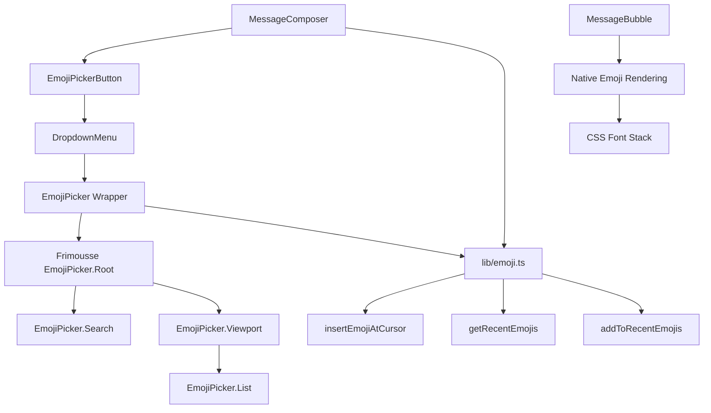

# Emoji Support Implementation Plan

**Document Version:** 1.0  
**Created:** 2025-12-30  
**Status:** Ready for Implementation  
**Estimated Effort:** 8-12 hours

---

## Executive Summary

This document provides a comprehensive implementation plan for adding emoji support to the SMS conversation system. The solution leverages the `frimousse` npm package - a lightweight, production-ready emoji picker component - instead of building a custom solution from scratch.

**Key Benefits:**
- ✅ Pre-built, battle-tested component
- ✅ Small bundle size (~15-20KB vs 200KB for emoji-mart)
- ✅ Built-in search, categories, and keyboard navigation
- ✅ Full accessibility support
- ✅ Matches existing dark theme UI

---

## Table of Contents

1. [Architecture Overview](#architecture-overview)
2. [Technology Stack](#technology-stack)
3. [Component Specifications](#component-specifications)
4. [Implementation Tasks](#implementation-tasks)
5. [Code Examples](#code-examples)
6. [Testing Strategy](#testing-strategy)
7. [Performance Considerations](#performance-considerations)
8. [Accessibility Requirements](#accessibility-requirements)
9. [Troubleshooting Guide](#troubleshooting-guide)

---

## Architecture Overview

### System Architecture



### File Structure

```
components/conversations/
├── EmojiPicker.tsx          # Frimousse wrapper component
├── EmojiPickerButton.tsx    # Toggle button with icon
├── MessageComposer.tsx      # Updated with emoji picker
└── MessageBubble.tsx        # Updated with emoji CSS

lib/
└── emoji.ts                 # Utility functions

package.json                 # Add frimousse dependency
```

---

## Technology Stack

### Dependencies

| Package | Version | Purpose | Bundle Size |
|---------|---------|---------|-------------|
| `frimousse` | `^1.0.0` | Emoji picker component | ~15-20KB |
| `lucide-react` | existing | Icons (Smile icon) | Already included |

### Installation Command

```bash
npm install frimousse
# or
pnpm add frimousse
# or
yarn add frimousse
```

---

## Component Specifications

### 1. EmojiPicker Component

**File:** `components/conversations/EmojiPicker.tsx`

**Purpose:** Wrapper around frimousse's EmojiPicker with custom styling to match the application's dark theme.

**Props Interface:**
```typescript
interface EmojiPickerProps {
  onEmojiSelect: (emoji: { emoji: string; label: string }) => void;
  onClose?: () => void;
  className?: string;
}
```

**Features:**
- Search bar for filtering emojis
- Categorized emoji grid
- Loading state
- Empty state (no results)
- Keyboard navigation
- ARIA labels for accessibility

**Styling Requirements:**
- Dark theme (gray-800 background)
- Border with gray-700
- Rounded corners (8px)
- Shadow for depth
- Hover states on emoji buttons
- Focus states for keyboard navigation

---

### 2. EmojiPickerButton Component

**File:** `components/conversations/EmojiPickerButton.tsx`

**Purpose:** Toggle button to open/close the emoji picker dropdown.

**Props Interface:**
```typescript
interface EmojiPickerButtonProps {
  onClick: () => void;
  disabled?: boolean;
  isOpen?: boolean;
  className?: string;
}
```

**Features:**
- Smile icon from lucide-react
- Tooltip on hover ("Add emoji")
- Active state when picker is open
- Disabled state styling
- Accessible button with ARIA labels

**Styling:**
- Size: 40px × 40px (h-10 w-10)
- Background: gray-800
- Border: gray-700
- Hover: gray-700 background
- Active (open): gray-600 background

---

### 3. MessageComposer Updates

**File:** `components/conversations/MessageComposer.tsx`

**Changes Required:**

1. **Add State:**
```typescript
const [showEmojiPicker, setShowEmojiPicker] = useState(false);
```

2. **Add Emoji Selection Handler:**
```typescript
const handleEmojiSelect = useCallback((emoji: { emoji: string; label: string }) => {
  if (!textareaRef.current) return;
  
  const { newValue, newCursorPos } = insertEmojiAtCursor(
    textareaRef.current,
    emoji.emoji,
    message
  );
  
  setMessage(newValue);
  addToRecentEmojis(emoji.emoji);
  setShowEmojiPicker(false);
  
  // Restore focus and cursor position
  setTimeout(() => {
    if (textareaRef.current) {
      textareaRef.current.focus();
      textareaRef.current.setSelectionRange(newCursorPos, newCursorPos);
    }
  }, 0);
}, [message]);
```

3. **Add UI Elements:**
- Place EmojiPickerButton next to the template button
- Wrap in DropdownMenu from existing UI components
- Position picker above the button (sideOffset={8})

**Layout:**
```
[Quick Template] [Template Button] [Emoji Button] [Textarea] [Send Button]
```

---

### 4. MessageBubble Updates

**File:** `components/conversations/MessageBubble.tsx`

**Changes Required:**

Add CSS class for proper emoji rendering:

```typescript
// In the message body paragraph
<p className={cn(
  "text-sm leading-relaxed break-words whitespace-pre-wrap",
  "emoji-text" // New class
)}>
  {message.body}
</p>
```

**Global CSS (app/globals.css):**
```css
.emoji-text {
  font-family: -apple-system, BlinkMacSystemFont, 'Segoe UI', 'Roboto', 
               'Helvetica Neue', Arial, 'Noto Color Emoji', 
               'Apple Color Emoji', 'Segoe UI Emoji', sans-serif;
  font-variant-emoji: emoji;
  line-height: 1.5;
}
```

---

### 5. Emoji Utilities

**File:** `lib/emoji.ts`

**Functions:**

#### `insertEmojiAtCursor`
```typescript
/**
 * Insert emoji at the current cursor position in a textarea
 * @param textarea - The textarea element
 * @param emoji - The emoji string to insert
 * @param currentValue - Current textarea value
 * @returns Object with new value and cursor position
 */
export function insertEmojiAtCursor(
  textarea: HTMLTextAreaElement,
  emoji: string,
  currentValue: string
): { newValue: string; newCursorPos: number } {
  const start = textarea.selectionStart ?? currentValue.length;
  const end = textarea.selectionEnd ?? currentValue.length;
  
  const newValue = 
    currentValue.slice(0, start) + 
    emoji + 
    currentValue.slice(end);
  
  const newCursorPos = start + emoji.length;
  
  return { newValue, newCursorPos };
}
```

#### `getRecentEmojis`
```typescript
/**
 * Get recently used emojis from localStorage
 * @returns Array of emoji strings (max 15)
 */
export function getRecentEmojis(): string[] {
  try {
    const stored = localStorage.getItem('recent-emojis');
    return stored ? JSON.parse(stored) : [];
  } catch (error) {
    console.error('Failed to load recent emojis:', error);
    return [];
  }
}
```

#### `addToRecentEmojis`
```typescript
/**
 * Add emoji to recent list (max 15, most recent first)
 * @param emoji - The emoji to add
 */
export function addToRecentEmojis(emoji: string): void {
  try {
    const recent = getRecentEmojis();
    
    // Remove if already exists
    const filtered = recent.filter(e => e !== emoji);
    
    // Add to front
    const updated = [emoji, ...filtered].slice(0, 15);
    
    localStorage.setItem('recent-emojis', JSON.stringify(updated));
  } catch (error) {
    console.error('Failed to save recent emoji:', error);
  }
}
```

---

## Implementation Tasks

### Phase 1: Setup & Dependencies (30 minutes)

- [ ] **Task 1.1:** Install frimousse package
  ```bash
  npm install frimousse
  ```
  
- [ ] **Task 1.2:** Verify installation and check bundle size
  ```bash
  npm list frimousse
  ```

- [ ] **Task 1.3:** Create `lib/emoji.ts` file with utility functions
  - Implement `insertEmojiAtCursor`
  - Implement `getRecentEmojis`
  - Implement `addToRecentEmojis`
  - Add TypeScript types

---

### Phase 2: Core Components (2-3 hours)

- [ ] **Task 2.1:** Create `EmojiPickerButton.tsx`
  - Import Smile icon from lucide-react
  - Implement button with hover/active states
  - Add ARIA labels
  - Add tooltip
  - Style to match existing UI (gray-800 theme)

- [ ] **Task 2.2:** Create `EmojiPicker.tsx` wrapper
  - Import frimousse components
  - Set up EmojiPicker.Root with dark theme
  - Add EmojiPicker.Search with styling
  - Configure EmojiPicker.Viewport
  - Style EmojiPicker.List with custom components:
    - CategoryHeader (sticky, gray-600 bg)
    - Row (flex layout)
    - Emoji (hover states, focus ring)
  - Add Loading and Empty states
  - Implement onEmojiSelect callback

- [ ] **Task 2.3:** Test standalone EmojiPicker
  - Create temporary test page
  - Verify search functionality
  - Verify category navigation
  - Verify emoji selection callback
  - Verify keyboard navigation

---

### Phase 3: MessageComposer Integration (2-3 hours)

- [ ] **Task 3.1:** Update MessageComposer state
  - Add `showEmojiPicker` state
  - Add `handleEmojiSelect` callback
  - Import emoji utilities

- [ ] **Task 3.2:** Add EmojiPickerButton to UI
  - Position next to template button
  - Wire up onClick handler
  - Pass isOpen state for styling

- [ ] **Task 3.3:** Integrate DropdownMenu
  - Wrap EmojiPicker in DropdownMenu
  - Configure positioning (sideOffset, align)
  - Handle open/close state
  - Add click-outside-to-close behavior

- [ ] **Task 3.4:** Implement emoji insertion
  - Call `insertEmojiAtCursor` on selection
  - Update message state
  - Restore textarea focus
  - Set cursor position after emoji

- [ ] **Task 3.5:** Add recent emojis tracking
  - Call `addToRecentEmojis` after selection
  - Verify localStorage persistence

---

### Phase 4: Message Display (1 hour)

- [ ] **Task 4.1:** Update MessageBubble CSS
  - Add `emoji-text` class to message body
  - Verify emoji rendering in bubbles

- [ ] **Task 4.2:** Add global emoji CSS
  - Update `app/globals.css`
  - Add font-family stack with emoji fonts
  - Add font-variant-emoji property
  - Test on different OS (Mac, Windows, Linux)

---

### Phase 5: Testing & Polish (2-3 hours)

- [ ] **Task 5.1:** Browser Testing
  - Chrome/Edge (Windows, Mac, Linux)
  - Firefox (Windows, Mac, Linux)
  - Safari (Mac, iOS)
  - Mobile browsers (iOS Safari, Chrome Mobile)

- [ ] **Task 5.2:** Functionality Testing
  - Emoji picker opens/closes correctly
  - Search filters emojis properly
  - Emoji inserts at cursor position
  - Emoji inserts at end if no cursor
  - Emoji inserts in middle of text
  - Recent emojis persist across sessions
  - Keyboard navigation works (Tab, Arrow keys, Enter, Escape)

- [ ] **Task 5.3:** Accessibility Testing
  - Screen reader announces emoji picker
  - All buttons have ARIA labels
  - Keyboard-only navigation works
  - Focus management is correct
  - Color contrast meets WCAG AA

- [ ] **Task 5.4:** Performance Testing
  - Measure bundle size impact
  - Test picker open/close performance
  - Test search performance with typing
  - Verify no memory leaks

---

### Phase 6: Unit Tests (1-2 hours)

- [ ] **Task 6.1:** Test emoji utility functions
  ```typescript
  // lib/emoji.test.ts
  describe('insertEmojiAtCursor', () => {
    it('inserts emoji at cursor position', () => {
      // Test implementation
    });
    
    it('inserts emoji at end when no cursor', () => {
      // Test implementation
    });
    
    it('replaces selected text with emoji', () => {
      // Test implementation
    });
  });
  
  describe('getRecentEmojis', () => {
    it('returns empty array when no recent emojis', () => {
      // Test implementation
    });
    
    it('returns stored recent emojis', () => {
      // Test implementation
    });
  });
  
  describe('addToRecentEmojis', () => {
    it('adds emoji to front of list', () => {
      // Test implementation
    });
    
    it('removes duplicate and adds to front', () => {
      // Test implementation
    });
    
    it('limits list to 15 emojis', () => {
      // Test implementation
    });
  });
  ```

- [ ] **Task 6.2:** Test EmojiPicker component
  - Renders without crashing
  - Calls onEmojiSelect when emoji clicked
  - Filters emojis based on search
  - Shows empty state when no results

- [ ] **Task 6.3:** Test EmojiPickerButton component
  - Renders with correct icon
  - Calls onClick when clicked
  - Shows active state when isOpen is true
  - Disabled state works correctly

---

### Phase 7: Documentation (1 hour)

- [ ] **Task 7.1:** Update component documentation
  - Add JSDoc comments to all components
  - Document props interfaces
  - Add usage examples

- [ ] **Task 7.2:** Update user documentation
  - Add emoji feature to user guide
  - Document keyboard shortcuts
  - Add screenshots/GIFs

- [ ] **Task 7.3:** Update developer documentation
  - Document emoji utilities API
  - Add troubleshooting section
  - Document browser compatibility

---

## Code Examples

### Complete EmojiPicker Component

```typescript
"use client";

import * as React from "react";
import { EmojiPicker as EmojiPickerPrimitive } from "frimousse";
import { LoaderIcon, SearchIcon } from "lucide-react";
import { cn } from "@/lib/utils";

export interface EmojiPickerProps {
  onEmojiSelect: (emoji: { emoji: string; label: string }) => void;
  onClose?: () => void;
  className?: string;
}

export function EmojiPicker({
  onEmojiSelect,
  onClose,
  className,
}: EmojiPickerProps) {
  return (
    <div
      className={cn(
        "w-80 max-w-[95vw] rounded-lg border border-gray-700 bg-gray-800 p-3 shadow-lg",
        className
      )}
    >
      <EmojiPickerPrimitive.Root onEmojiSelect={onEmojiSelect}>
        {/* Search Input */}
        <div className="mb-2 flex items-center gap-2 rounded-md border border-gray-600 bg-gray-700 px-3 py-2">
          <SearchIcon className="h-4 w-4 text-gray-400" />
          <EmojiPickerPrimitive.Search
            className="flex-1 bg-transparent text-sm text-gray-100 placeholder:text-gray-400 focus:outline-none"
            placeholder="Search emojis..."
          />
        </div>

        {/* Emoji Grid */}
        <EmojiPickerPrimitive.Viewport className="h-64 w-full overflow-y-auto rounded-md border border-gray-700 bg-gray-900">
          {/* Loading State */}
          <EmojiPickerPrimitive.Loading>
            <div className="flex h-full items-center justify-center text-gray-400">
              <LoaderIcon className="h-6 w-6 animate-spin" />
            </div>
          </EmojiPickerPrimitive.Loading>

          {/* Empty State */}
          <EmojiPickerPrimitive.Empty>
            <div className="flex h-full items-center justify-center text-sm text-gray-400">
              No emoji found.
            </div>
          </EmojiPickerPrimitive.Empty>

          {/* Emoji List */}
          <EmojiPickerPrimitive.List
            className="select-none pb-1.5"
            components={{
              CategoryHeader: ({ category, ...props }) => (
                <div
                  className="sticky top-0 z-10 bg-gray-900 px-3 pb-1.5 pt-3 text-xs font-medium text-gray-400"
                  {...props}
                >
                  {category.label}
                </div>
              ),
              Row: ({ children, ...props }) => (
                <div className="flex scroll-my-1.5 gap-1 px-1.5" {...props}>
                  {children}
                </div>
              ),
              Emoji: ({ emoji, ...props }) => (
                <button
                  className="flex h-8 w-8 items-center justify-center rounded-md text-lg transition-colors hover:bg-gray-700 focus:bg-gray-700 focus:outline-none focus:ring-2 focus:ring-purple-500"
                  {...props}
                >
                  {emoji.emoji}
                </button>
              ),
            }}
          />
        </EmojiPickerPrimitive.Viewport>
      </EmojiPickerPrimitive.Root>
    </div>
  );
}
```

### Complete EmojiPickerButton Component

```typescript
"use client";

import * as React from "react";
import { Smile } from "lucide-react";
import { cn } from "@/lib/utils";

export interface EmojiPickerButtonProps {
  onClick: () => void;
  disabled?: boolean;
  isOpen?: boolean;
  className?: string;
}

export function EmojiPickerButton({
  onClick,
  disabled = false,
  isOpen = false,
  className,
}: EmojiPickerButtonProps) {
  return (
    <button
      type="button"
      onClick={onClick}
      disabled={disabled}
      aria-label="Add emoji"
      aria-expanded={isOpen}
      className={cn(
        "flex h-10 w-10 items-center justify-center rounded-lg transition-colors",
        "focus:outline-none focus:ring-2 focus:ring-purple-500 focus:ring-offset-2 focus:ring-offset-gray-900",
        disabled
          ? "cursor-not-allowed bg-gray-700 text-gray-500 opacity-50"
          : [
              "bg-gray-800 text-gray-300 border border-gray-700",
              "hover:bg-gray-700 hover:text-white",
              isOpen && "bg-gray-600 text-white",
            ],
        className
      )}
    >
      <Smile className="h-5 w-5" aria-hidden="true" />
    </button>
  );
}
```

### MessageComposer Integration Example

```typescript
// In MessageComposer.tsx

import { EmojiPicker } from "@/components/conversations/EmojiPicker";
import { EmojiPickerButton } from "@/components/conversations/EmojiPickerButton";
import { insertEmojiAtCursor, addToRecentEmojis } from "@/lib/emoji";
import {
  DropdownMenu,
  DropdownMenuContent,
  DropdownMenuTrigger,
} from "@/components/ui/dropdown-menu";

// ... existing imports and component code ...

export function MessageComposer({ onSend, disabled, ... }: MessageComposerProps) {
  // ... existing state ...
  const [showEmojiPicker, setShowEmojiPicker] = useState(false);
  
  const handleEmojiSelect = useCallback((emoji: { emoji: string; label: string }) => {
    if (!textareaRef.current) return;
    
    const { newValue, newCursorPos } = insertEmojiAtCursor(
      textareaRef.current,
      emoji.emoji,
      message
    );
    
    setMessage(newValue);
    addToRecentEmojis(emoji.emoji);
    setShowEmojiPicker(false);
    
    // Restore focus and cursor position
    setTimeout(() => {
      if (textareaRef.current) {
        textareaRef.current.focus();
        textareaRef.current.setSelectionRange(newCursorPos, newCursorPos);
      }
    }, 0);
  }, [message]);

  return (
    <div className="flex flex-col gap-2 p-4 border-t border-gray-700 bg-gray-900">
      {/* ... existing template preview ... */}
      
      <div className="flex gap-2 items-end">
        {/* Quick Template Button */}
        {/* ... existing quick template button ... */}
        
        {/* Template Selector Button */}
        {/* ... existing template button ... */}
        
        {/* Emoji Picker Button */}
        <DropdownMenu open={showEmojiPicker} onOpenChange={setShowEmojiPicker}>
          <DropdownMenuTrigger asChild>
            <EmojiPickerButton
              onClick={() => setShowEmojiPicker(!showEmojiPicker)}
              disabled={disabled || isSending}
              isOpen={showEmojiPicker}
            />
          </DropdownMenuTrigger>
          <DropdownMenuContent
            className="w-fit min-w-[180px] max-w-[95vw] rounded-lg border-0 p-0"
            sideOffset={8}
            align="start"
          >
            <EmojiPicker
              onEmojiSelect={handleEmojiSelect}
              onClose={() => setShowEmojiPicker(false)}
            />
          </DropdownMenuContent>
        </DropdownMenu>
        
        {/* Textarea */}
        <div className="relative flex-1 flex items-end">
          <textarea
            ref={textareaRef}
            value={message}
            onChange={handleChange}
            onKeyDown={handleKeyDown}
            // ... other props ...
          />
        </div>
        
        {/* Send button */}
        {/* ... existing send button ... */}
      </div>
      
      {/* ... existing status bar ... */}
    </div>
  );
}
```

---

## Testing Strategy

### Manual Testing Checklist

#### Emoji Picker Functionality
- [ ] Picker opens when emoji button is clicked
- [ ] Picker closes when clicking outside
- [ ] Picker closes when pressing Escape key
- [ ] Search filters emojis correctly
- [ ] Search is case-insensitive
- [ ] Clicking an emoji inserts it into the message
- [ ] Picker closes after emoji selection
- [ ] Focus returns to textarea after selection

#### Emoji Insertion
- [ ] Emoji inserts at cursor position
- [ ] Emoji inserts at end when no cursor
- [ ] Emoji replaces selected text
- [ ] Cursor position is correct after insertion
- [ ] Multiple emojis can be inserted
- [ ] Emojis work with text before and after

#### Recent Emojis
- [ ] Recent emojis persist across page reloads
- [ ] Most recent emoji appears first
- [ ] Duplicate emojis move to front
- [ ] List is limited to 15 emojis
- [ ] Recent emojis work in private/incognito mode (graceful fallback)

#### Message Display
- [ ] Emojis render correctly in sent messages
- [ ] Emojis render correctly in received messages
- [ ] Emojis don't break message layout
- [ ] Multiple emojis in one message work
- [ ] Emojis with text work correctly

#### Keyboard Navigation
- [ ] Tab moves focus through picker elements
- [ ] Arrow keys navigate emoji grid
- [ ] Enter selects focused emoji
- [ ] Escape closes picker
- [ ] Focus visible on all elements

#### Accessibility
- [ ] Screen reader announces picker state
- [ ] All buttons have descriptive labels
- [ ] Emoji labels are announced
- [ ] Focus management is correct
- [ ] Color contrast is sufficient

### Browser Compatibility Matrix

| Browser | Version | Desktop | Mobile | Status |
|---------|---------|---------|--------|--------|
| Chrome | 120+ | ✅ | ✅ | Test |
| Firefox | 115+ | ✅ | ✅ | Test |
| Safari | 16+ | ✅ | ✅ | Test |
| Edge | 120+ | ✅ | N/A | Test |

### Performance Benchmarks

| Metric | Target | Measurement Method |
|--------|--------|-------------------|
| Bundle size increase | < 25KB | webpack-bundle-analyzer |
| Picker open time | < 100ms | Chrome DevTools Performance |
| Search response time | < 50ms | Chrome DevTools Performance |
| Memory usage | < 5MB | Chrome DevTools Memory |

---

## Performance Considerations

### Bundle Size Optimization

1. **Tree Shaking:** Frimousse is tree-shakeable, so only import what you need
2. **Code Splitting:** The emoji picker can be lazy-loaded if needed
3. **Compression:** Ensure gzip/brotli compression is enabled

### Runtime Performance

1. **Virtualization:** Frimousse uses virtual scrolling for the emoji list
2. **Search Optimization:** Search is debounced and uses efficient filtering
3. **Memoization:** Use React.memo for EmojiPicker and EmojiPickerButton

### Memory Management

1. **Event Listeners:** Ensure proper cleanup in useEffect hooks
2. **LocalStorage:** Limit recent emojis to 15 to prevent storage bloat
3. **Component Unmounting:** Properly clean up state when picker closes

---

## Accessibility Requirements

### WCAG 2.1 AA Compliance

1. **Keyboard Navigation:**
   - All interactive elements must be keyboard accessible
   - Tab order must be logical
   - Focus indicators must be visible

2. **Screen Reader Support:**
   - All buttons must have descriptive ARIA labels
   - Emoji picker state must be announced
   - Selected emoji must be announced

3. **Color Contrast:**
   - Text must have 4.5:1 contrast ratio
   - Interactive elements must have 3:1 contrast ratio
   - Focus indicators must have 3:1 contrast ratio

4. **Focus Management:**
   - Focus must return to trigger button after picker closes
   - Focus must be trapped within picker when open
   - Escape key must close picker and return focus

### ARIA Attributes

```typescript
// EmojiPickerButton
aria-label="Add emoji"
aria-expanded={isOpen}
aria-haspopup="dialog"

// EmojiPicker
role="dialog"
aria-label="Emoji picker"
aria-modal="true"

// Search Input
aria-label="Search emojis"
role="searchbox"

// Emoji Buttons
aria-label={emoji.label}
role="button"
```

---

## Troubleshooting Guide

### Common Issues

#### Issue: Emoji picker doesn't open

**Symptoms:** Clicking the emoji button does nothing

**Solutions:**
1. Check browser console for errors
2. Verify frimousse is installed: `npm list frimousse`
3. Check if DropdownMenu is properly configured
4. Verify state management (showEmojiPicker)

#### Issue: Emojis not rendering correctly

**Symptoms:** Emojis show as boxes or question marks

**Solutions:**
1. Verify font-family includes emoji fonts
2. Check if font-variant-emoji is set
3. Test on different OS/browsers
4. Verify emoji CSS class is applied

#### Issue: Cursor position wrong after insertion

**Symptoms:** Cursor jumps to wrong position after emoji

**Solutions:**
1. Check insertEmojiAtCursor implementation
2. Verify setTimeout is used for focus restoration
3. Check if setSelectionRange is called correctly

#### Issue: Recent emojis not persisting

**Symptoms:** Recent emojis disappear on page reload

**Solutions:**
1. Check localStorage permissions
2. Verify JSON serialization/deserialization
3. Check for localStorage quota errors
4. Test in private/incognito mode

#### Issue: Search not working

**Symptoms:** Search doesn't filter emojis

**Solutions:**
1. Verify EmojiPicker.Search is rendered
2. Check if frimousse is properly configured
3. Test with simple search terms
4. Check browser console for errors

### Debug Mode

Enable debug logging by adding to `lib/emoji.ts`:

```typescript
const DEBUG = process.env.NODE_ENV === 'development';

function debugLog(...args: any[]) {
  if (DEBUG) {
    console.log('[Emoji]', ...args);
  }
}

// Use in functions:
export function insertEmojiAtCursor(...) {
  debugLog('Inserting emoji:', emoji, 'at position:', start);
  // ... rest of function
}
```

---

## Success Criteria

The implementation is considered complete when:

- [ ] All 13 implementation tasks are completed
- [ ] All manual tests pass
- [ ] All unit tests pass
- [ ] Browser compatibility is verified
- [ ] Performance benchmarks are met
- [ ] Accessibility requirements are met
- [ ] Documentation is complete
- [ ] Code review is approved
- [ ] User acceptance testing is passed

---

## References

### Documentation
- [Frimousse GitHub](https://github.com/missive/frimousse)
- [Emoji Unicode Standard](https://unicode.org/emoji/)
- [WCAG 2.1 Guidelines](https://www.w3.org/WAI/WCAG21/quickref/)
- [React Accessibility](https://react.dev/learn/accessibility)

### Related Files
- [`components/conversations/MessageComposer.tsx`](../components/conversations/MessageComposer.tsx)
- [`components/conversations/MessageBubble.tsx`](../components/conversations/MessageBubble.tsx)
- [`types/sms.ts`](../types/sms.ts)

---

## Appendix

### Alternative Solutions Considered

1. **emoji-mart** - Rejected due to large bundle size (200KB+)
2. **Custom implementation** - Rejected due to development time and maintenance burden
3. **emoji-picker-react** - Rejected due to less active maintenance
4. **Native emoji picker** - Rejected due to inconsistent browser support

### Future Enhancements

1. **Skin tone variations** - Add support for emoji skin tone modifiers
2. **Custom emojis