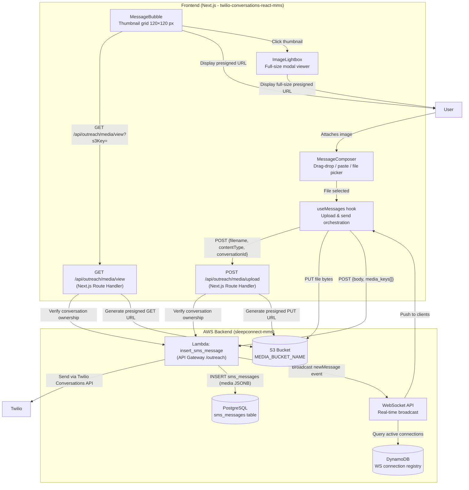
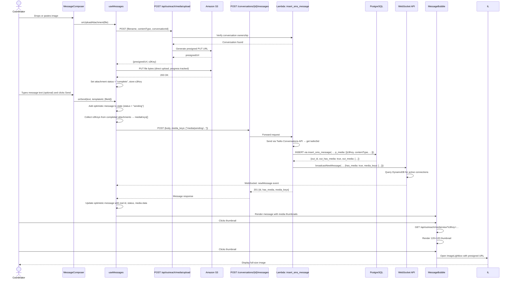

# MMS Feature Documentation

## Table of Contents

1. [Overview](#1-overview)
2. [Architecture](#2-architecture)
3. [Database Schema](#3-database-schema)
4. [API Endpoints](#4-api-endpoints)
5. [Frontend Components](#5-frontend-components)
6. [Data Flow](#6-data-flow)
7. [Configuration](#7-configuration)
8. [File Changes Summary](#8-file-changes-summary)
9. [Troubleshooting](#9-troubleshooting)

---

## 1. Overview

MMS (Multimedia Messaging Service) support allows coordinators to send and receive images within SMS conversations in the Outreach application. Prior to this feature, conversations were limited to plain-text SMS messages. With MMS support, coordinators can:

- Attach images to outbound messages using drag-and-drop, paste, or a file picker
- View image thumbnails inline within the conversation thread
- Open a full-size lightbox viewer to inspect received or sent images
- Receive inbound MMS images sent by patients via Twilio

The feature was implemented to support the common clinical workflow where patients share photos of their equipment, sleep appliances, or supporting documents directly over SMS, and coordinators need to view and respond to those images within the same conversation interface.

Media files are stored in Amazon S3, and only presigned URLs are ever passed to the browser. Raw S3 keys are never exposed directly to frontend clients. Access to any presigned URL is gated on conversation ownership verification performed server-side.

---

## 2. Architecture

### Component Diagram



### Key Design Decisions

- **Presigned URLs over direct S3 access**: All image delivery goes through server-side authorization. The browser never receives a raw S3 key as a usable URL.
- **Pending key namespace**: Uploaded files are stored under `media/pending/{conversationId}/{uuid}/{filename}` before the message is sent, and `media/committed/` after. This allows cleanup of abandoned uploads.
- **S3 keys as the source of truth**: The `media` JSONB column stores S3 keys, not presigned URLs. Presigned URLs are ephemeral and generated on demand with a 7-day TTL for viewing.
- **Fallback polling + WebSocket**: The `useMessages` hook uses a background Web Worker for polling alongside a WebSocket connection. If the WebSocket is unavailable, polling ensures messages (including MMS) still appear.

---

## 3. Database Schema

### Migration 018: `018_add_mms_support.sql`

Applied on 2026-02-20. This migration is idempotent and backward-compatible.

#### Changes to `sms_messages`

| Column      | Type                                                     | Default | Description                                           |
| ----------- | -------------------------------------------------------- | ------- | ----------------------------------------------------- |
| `media`     | `JSONB`                                                  | `NULL`  | Array of media objects. `NULL` for SMS-only messages. |
| `has_media` | `BOOLEAN GENERATED ALWAYS AS (media IS NOT NULL) STORED` | —       | Computed indicator; `true` when `media` is non-null.  |

**Media array element schema** (each element in the `media` JSONB array):

```json
{
  "s3Key": "media/committed/{conversationId}/{uuid}/{filename}",
  "contentType": "image/jpeg",
  "size": 204800,
  "originalFilename": "photo.jpg"
}
```

**Constraint** `chk_sms_messages_media_array`:

```sql
CHECK (
    media IS NULL
    OR (
        jsonb_typeof(media) = 'array'
        AND jsonb_array_length(media) BETWEEN 1 AND 10
    )
)
```

A message may carry between 1 and 10 media attachments. Exceeding this limit raises a constraint violation at the database layer.

#### Updated Functions

**`public.insert_sms_message`** — signature after migration:

```sql
CREATE OR REPLACE FUNCTION public.insert_sms_message(
    p_conversation_id UUID,
    p_tenant_id       UUID,
    p_practice_id     UUID,
    p_twilio_sid      VARCHAR(34),
    p_direction       sms_message_direction,
    p_body            TEXT,
    p_created_by      BIGINT,
    p_author_sax_id   BIGINT             DEFAULT NULL,
    p_author_phone    VARCHAR(15)        DEFAULT NULL,
    p_status          sms_message_status DEFAULT 'sending',
    p_segment_count   INTEGER            DEFAULT 1,
    p_media           JSONB              DEFAULT NULL   -- Added in migration 018
)
RETURNS TABLE(
    out_id              UUID,
    out_conversation_id UUID,
    out_twilio_sid      VARCHAR(34),
    out_direction       sms_message_direction,
    out_status          sms_message_status,
    out_created_on      TIMESTAMPTZ,
    out_media           JSONB,     -- Added in migration 018
    out_has_media       BOOLEAN,   -- Added in migration 018
    out_created_by      BIGINT
)
```

The `p_media` parameter accepts a JSONB array of S3 keys. All pre-existing callers that omit this parameter continue to work unchanged because the parameter defaults to `NULL`.

**`public.get_sms_messages_for_conversation`** — new columns in the RETURNS TABLE:

| Column          | Type      | Description                            |
| --------------- | --------- | -------------------------------------- |
| `out_media`     | `JSONB`   | Media array for the message, or `NULL` |
| `out_has_media` | `BOOLEAN` | `true` when `out_media` is non-null    |

These columns appear before `out_total_count` in the return table. Callers that reference columns by name are unaffected.

---

## 4. API Endpoints

### `POST /api/outreach/media/upload`

**Location**: `app/api/outreach/media/upload/route.ts`

Generates a presigned PUT URL so the frontend can upload a media file directly to S3. The file lands in the `media/pending/{conversationId}/{uuid}/{filename}` key namespace.

**Authentication**: Requires a valid user session (`withUserContext` middleware). Validates that the requesting user owns the specified conversation before issuing an upload URL.

**Accepted file types**: `image/jpeg`, `image/png`, `image/gif` (extensions: `jpg`, `jpeg`, `png`, `gif`)

**Limits**:

- Maximum filename length: 255 characters
- Presigned URL validity: 15 minutes (900 seconds)

**Request body**:

```json
{
  "filename": "photo.jpg",
  "contentType": "image/jpeg",
  "conversationId": "550e8400-e29b-41d4-a716-446655440000"
}
```

**Success response (200)**:

```json
{
  "presignedUrl": "https://s3.amazonaws.com/my-bucket/media/pending/550e8400-.../...",
  "s3Key": "media/pending/550e8400-e29b-41d4-a716-446655440000/7f3a4b2c/photo.jpg",
  "bucket": "sax-media-bucket",
  "expiresAt": "2026-02-23T10:15:00.000Z"
}
```

**Error responses**:

| Status | Condition                                                         |
| ------ | ----------------------------------------------------------------- |
| 400    | Missing or invalid `filename`, `contentType`, or `conversationId` |
| 400    | File extension not in allowed list                                |
| 400    | Content type does not start with `image/`                         |
| 404    | Conversation not found or user does not own it                    |
| 500    | `MEDIA_BUCKET_NAME` environment variable not configured           |

---

### `POST /api/outreach/media/view`

**Location**: `app/api/outreach/media/view/route.ts`

Generates presigned GET URLs for a batch of S3 keys. All keys must belong to conversations the requesting user owns. Intended for pre-fetching multiple images in a conversation load.

**Authentication**: Requires valid user session. Each key is verified against conversation ownership before a URL is issued.

**Limits**: Maximum 50 keys per request.

**Request body**:

```json
{
  "keys": [
    "media/committed/550e8400-.../7f3a4b2c/photo.jpg",
    "media/committed/550e8400-.../8a1b3c4d/document.png"
  ]
}
```

**Success response (200)**:

```json
{
  "urls": {
    "media/committed/550e8400-.../7f3a4b2c/photo.jpg": "https://s3.amazonaws.com/...",
    "media/committed/550e8400-.../8a1b3c4d/document.png": "https://s3.amazonaws.com/..."
  }
}
```

The presigned GET URL TTL is 7 days (604,800 seconds).

---

### `GET /api/outreach/media/view?s3Key=<key>`

**Location**: `app/api/outreach/media/view/route.ts`

Generates a single presigned GET URL for one S3 key. Used by `MessageBubble` to fetch the display URL for each thumbnail individually.

**Query parameter**: `s3Key` — the S3 key string (URL-encoded)

**Success response (200)**:

```json
{
  "presignedUrl": "https://s3.amazonaws.com/my-bucket/media/committed/..."
}
```

**Error responses**:

| Status | Condition                             |
| ------ | ------------------------------------- |
| 400    | `s3Key` query parameter missing       |
| 400    | Invalid S3 key format                 |
| 404    | Media item not found or access denied |
| 500    | Failed to generate presigned URL      |

---

### Lambda: `insert_sms_message`

**Location**: `lambdas/lambda-sms-outreach/insert_sms_message/index.mjs`

Receives a request from the frontend API route, sends the message through the Twilio Conversations API, stores it in PostgreSQL via `public.insert_sms_message`, and broadcasts the new message to active WebSocket connections.

**Request body** (additional MMS fields):

```json
{
  "body": "Please see the attached image.",
  "direction": "outbound",
  "author_sax_id": 1234,
  "segment_count": 1,
  "template_id": "optional-uuid",
  "media_keys": ["media/committed/550e8400-.../7f3a4b2c/photo.jpg"]
}
```

The `media_keys` field is an array of S3 key strings. The Lambda converts this into the JSONB array format expected by `insert_sms_message` (wrapping keys in objects is handled by the calling API route, which constructs the media metadata from `PendingAttachment` state).

**Success response (201)**:

```json
{
  "id": "a1b2c3d4-e5f6-7890-abcd-ef1234567890",
  "conversation_id": "550e8400-e29b-41d4-a716-446655440000",
  "twilio_sid": "SMxxxxxxxxxxxxxxxxxxxxxxxxxxxxxxxx",
  "direction": "outbound",
  "author_sax_id": 1234,
  "body": "Please see the attached image.",
  "status": "sent",
  "segment_count": 1,
  "created_on": "2026-02-23T10:00:00.000Z",
  "created_by": 1234,
  "has_media": true,
  "media_keys": ["media/committed/550e8400-.../7f3a4b2c/photo.jpg"]
}
```

The response includes `has_media` (boolean) and `media_keys` (array of S3 key strings). The frontend uses these fields to update the optimistic message in state.

---

## 5. Frontend Components

### MessageBubble

**Location**: `components/conversations/MessageBubble.tsx`

Renders a single message in the conversation thread. When a message has media attachments, `MessageBubble` fetches a presigned URL for each S3 key and displays them as a thumbnail grid.

**Media display behavior**:

- Thumbnails are rendered at 120×120 pixels with `object-cover` to fill the frame uniformly.
- Grid columns scale with attachment count: 1 column for 1 image, 2 for 2, 3 or more for 3+.
- A maximum of 4 thumbnails are shown inline. If a message has more than 4 attachments, the fourth thumbnail displays an overlay showing the remaining count (e.g., "+2").
- While presigned URLs are being fetched, skeleton placeholders matching the thumbnail size are shown.
- Each thumbnail is rendered as a `<button>` for keyboard and screen reader accessibility. Clicking opens the `ImageLightbox`.

**Props**:

| Prop           | Type                                              | Description                                   |
| -------------- | ------------------------------------------------- | --------------------------------------------- |
| `message`      | `Message`                                         | The message object to render                  |
| `senderName`   | `string?`                                         | Display name for the sender                   |
| `className`    | `string?`                                         | Additional CSS classes                        |
| `onImageClick` | `(imageIndex: number, images: string[]) => void?` | Optional callback when a thumbnail is clicked |

**Media URL fetching**: Triggered by a `useEffect` that runs when `message.media` changes. Calls `GET /api/outreach/media/view?s3Key=` for each attachment in parallel.

---

### ImageLightbox

**Location**: `components/conversations/ImageLightbox.tsx`

A full-screen modal viewer for message attachments. Built on top of Radix UI's `Dialog` primitive for accessible modal behavior.

**Features**:

- Semi-transparent black backdrop (90% opacity) with backdrop blur.
- Clicking the backdrop (outside the image) closes the lightbox.
- Navigation arrows appear when there is more than one image; previous/next arrows are conditionally rendered based on `currentIndex`.
- Keyboard navigation: left arrow, right arrow, and Escape are handled via a `keydown` listener attached to `window`.
- A loading spinner is shown while the image is loading; the image fades in once loaded.
- An image counter badge (`1 / 3`) is fixed at the bottom center.
- A close button is fixed at the top right.

**Props**:

| Prop           | Type                       | Description                              |
| -------------- | -------------------------- | ---------------------------------------- |
| `isOpen`       | `boolean`                  | Controls whether the lightbox is visible |
| `onClose`      | `() => void`               | Callback to close the lightbox           |
| `images`       | `string[]`                 | Array of presigned image URLs            |
| `currentIndex` | `number`                   | Index of the currently displayed image   |
| `onNavigate`   | `(index: number) => void?` | Callback to change the current image     |

---

### MessageComposer

**Location**: `components/conversations/MessageComposer.tsx`

The text input area at the bottom of the conversation view. Manages attachment selection, upload tracking, and message sending.

**Attachment input methods**:

1. **File picker**: A hidden `<input type="file">` is triggered by clicking the paperclip button. Accepts `image/jpeg`, `image/png`, and `image/gif`.
2. **Drag and drop**: The composer container listens for `dragover`, `dragenter`, `dragleave`, and `drop` events. A visual overlay with dashed border and a drop prompt appears while files are being dragged over the area.
3. **Paste**: The textarea's `onPaste` handler intercepts clipboard events containing image data. Non-image paste events pass through normally.

**Attachment constraints enforced in the UI**:

| Constraint                    | Limit          |
| ----------------------------- | -------------- |
| Maximum files per message     | 5              |
| Maximum size per file         | 5 MB           |
| Maximum total attachment size | 25 MB          |
| Accepted types                | JPEG, PNG, GIF |

**Attachment preview strip**: Uploaded files appear as 192×96 px cards below the textarea, showing a thumbnail, filename, file size, upload progress bar, and status (`uploading`, `complete`, `error`). An `×` button appears on hover to cancel in-flight uploads or remove completed ones. A retry button appears for failed uploads.

**Send button behavior**: The send button is disabled while any attachment is in the `uploading` or `pending` state. Sending requires either non-empty message text, or at least one attachment with `complete` status and a valid `s3Key`.

**Key props**:

| Prop                 | Type                                                                                | Description                                               |
| -------------------- | ----------------------------------------------------------------------------------- | --------------------------------------------------------- |
| `onSend`             | `(message: string, templateId?: string, attachmentIds?: string[]) => Promise<void>` | Called when the user submits a message                    |
| `pendingAttachments` | `Map<string, PendingAttachment>`                                                    | Current attachment state managed by `useMessages`         |
| `onUploadAttachment` | `(file: File) => Promise<unknown>`                                                  | Initiates an S3 upload via `useMessages.uploadAttachment` |
| `onCancelUpload`     | `(fileId: string) => void`                                                          | Aborts an in-flight upload                                |
| `onRemoveAttachment` | `(fileId: string) => void`                                                          | Removes a completed or errored attachment                 |

---

## 6. Data Flow

### Sending a Message with Media

The following steps describe the complete flow when a coordinator attaches an image and sends a message.



### Receiving an Inbound MMS

When a patient sends an MMS to the practice phone number, Twilio delivers a webhook to the backend. The inbound webhook handler stores the message with media keys, and the WebSocket broadcast delivers a `newMessage` event to the coordinator's browser. The `useMessages` hook processes the event and dispatches it to state. `MessageBubble` then fetches presigned URLs and renders the thumbnails.

---

## 7. Configuration

### Required Environment Variables

#### Frontend (`twilio-conversations-react-mms`)

| Variable                 | Description                                                                                                                                   |
| ------------------------ | --------------------------------------------------------------------------------------------------------------------------------------------- |
| `MEDIA_BUCKET_NAME`      | Name of the S3 bucket used for media storage. Must match the bucket configured for the Lambda and for CORS. Example: `sax-media-outreach-dev` |
| `NEXT_PUBLIC_WS_API_URL` | WebSocket API endpoint for real-time message updates. Example: `wss://outreach-ws-dev.mydreamconnect.com`                                     |

The `MEDIA_BUCKET_NAME` variable is required by both `app/api/outreach/media/upload/route.ts` and `app/api/outreach/media/view/route.ts`. If it is absent, the upload endpoint returns HTTP 500.

#### Backend Lambda (`lambda-sms-outreach/insert_sms_message`)

| Variable             | Description                                                  |
| -------------------- | ------------------------------------------------------------ |
| `TWILIO_ACCOUNT_SID` | Twilio account SID for sending messages                      |
| `TWILIO_AUTH_TOKEN`  | Twilio auth token                                            |
| `SECRET_ARN`         | AWS Secrets Manager ARN containing database credentials      |
| `HOST`               | PostgreSQL host                                              |
| `PORT`               | PostgreSQL port (default: 5432)                              |
| `PG_DB`              | PostgreSQL database name                                     |
| `WS_API_ENDPOINT`    | API Gateway Management API endpoint for WebSocket broadcasts |
| `DYNAMODB_TABLE`     | DynamoDB table name for WebSocket connection registry        |

### S3 CORS Configuration

The S3 bucket must allow PUT requests from the frontend origin so that browsers can upload files directly using presigned URLs. The required CORS configuration:

```json
[
  {
    "AllowedHeaders": ["*"],
    "AllowedMethods": ["PUT", "GET"],
    "AllowedOrigins": [
      "https://outreach.mydreamconnect.com",
      "https://outreach-dev.mydreamconnect.com"
    ],
    "ExposeHeaders": ["ETag"],
    "MaxAgeSeconds": 3000
  }
]
```

Without the PUT method in `AllowedMethods`, direct S3 uploads from the browser will fail with a CORS error, even though the presigned URL itself is valid.

### Database Migration

Migration `018_add_mms_support.sql` must be applied before deploying the MMS feature. The migration is idempotent and safe to run against a database that already has the columns (each step is wrapped in a `DO $$ IF NOT EXISTS` block).

To verify the migration has been applied:

```sql
SELECT column_name, data_type, is_nullable, column_default
FROM information_schema.columns
WHERE table_schema = 'public'
  AND table_name = 'sms_messages'
  AND column_name IN ('media', 'has_media')
ORDER BY column_name;
```

Expected output: two rows — `has_media` (boolean, not nullable) and `media` (jsonb, nullable).

---

## 8. File Changes Summary

### Backend — `sleepconnect-mms`

| File                                                       | Type     | Description                                                                                                                                                                                                                                                                                          |
| ---------------------------------------------------------- | -------- | ---------------------------------------------------------------------------------------------------------------------------------------------------------------------------------------------------------------------------------------------------------------------------------------------------- |
| `database/migrations/sms/018_add_mms_support.sql`          | New      | Adds `media` (JSONB) and `has_media` (generated BOOLEAN) columns to `sms_messages`; adds `chk_sms_messages_media_array` CHECK constraint; recreates `insert_sms_message` with `p_media` parameter; recreates `get_sms_messages_for_conversation` with `out_media` and `out_has_media` output columns |
| `database/functions/sms/insert_sms_message.sql`            | Modified | Updated to include `p_media JSONB DEFAULT NULL` parameter and return `out_media`, `out_has_media`, `out_created_by` columns                                                                                                                                                                          |
| `lambdas/lambda-sms-outreach/insert_sms_message/index.mjs` | Modified | Reads `media_keys` from request body; passes as `$12` parameter in `insert_sms_message` call; includes `has_media` and `media_keys` in the broadcast payload and HTTP response                                                                                                                       |

### Frontend — `twilio-conversations-react-mms`

| File                                           | Type     | Description                                                                                                                                                                                                                                                                                                                              |
| ---------------------------------------------- | -------- | ---------------------------------------------------------------------------------------------------------------------------------------------------------------------------------------------------------------------------------------------------------------------------------------------------------------------------------------- |
| `app/api/outreach/media/upload/route.ts`       | New      | `POST /api/outreach/media/upload` — validates file type, verifies conversation ownership, returns presigned S3 PUT URL                                                                                                                                                                                                                   |
| `app/api/outreach/media/view/route.ts`         | Modified | Added `GET /api/outreach/media/view?s3Key=` handler alongside the existing `POST` batch handler. The GET handler is used by `MessageBubble` to fetch individual thumbnail URLs                                                                                                                                                           |
| `components/conversations/MessageBubble.tsx`   | Modified | Added media rendering: fetches presigned URLs via `useEffect`, displays 120×120 thumbnail grid with `object-cover`, shows skeleton placeholders while loading, renders `+N` overlay for messages with more than 4 attachments, opens `ImageLightbox` on click                                                                            |
| `components/conversations/ImageLightbox.tsx`   | New      | Full-screen Radix UI Dialog-based image viewer; supports keyboard navigation (arrow keys, Escape), navigation arrows, loading spinner, image counter badge, and backdrop-click-to-close                                                                                                                                                  |
| `components/conversations/MessageComposer.tsx` | Modified | Added drag-and-drop zone, paste-from-clipboard support, hidden file input, `AttachmentPreview` sub-component with progress bar, validation for file type/size/count limits, and send-gate logic requiring all attachments to be `complete` before sending                                                                                |
| `hooks/useMessages.ts`                         | Modified | Added `uploadAttachment`, `cancelUpload`, and `removeAttachment` functions; manages `pendingAttachments` state (Map of `fileId → PendingAttachment`); extracts `s3Key` values from completed attachments and passes them as `mediaKeys` in the send payload; maps `media` field from WebSocket `newMessage` events to the `Message` type |
| `lib/messages.ts`                              | Modified | Added `media_keys` field to `LambdaMessageResponse` interface; updated `transformMessage` to map `media_keys` to the `media` array on the `Message` type (with fallback `contentType` and `size` values); added `sendMessageViaTwilio` to pass `mediaUrl` to the Twilio client                                                           |

---

## 9. Troubleshooting

### Lambda RETURNING clause missing `has_media` and `media_keys`

**Symptom**: Messages with attachments arrive from the Lambda but `has_media` is `false` and `media_keys` is `null` in the HTTP 201 response.

**Root cause**: The `insert_sms_message` Lambda was reading `out_has_media` and `out_media` from `result.rows[0]`, but an earlier version of the database function did not include these columns in the `RETURNS TABLE` definition. The function returned only the original six columns, so `result.rows[0].out_has_media` was `undefined`.

**Fix applied**: Migration `018_add_mms_support.sql` recreates `insert_sms_message` with `out_media`, `out_has_media`, and `out_created_by` added to the `RETURNS TABLE`. The Lambda at line 499 now correctly reads `result.rows[0].out_media`. Verify the migration has been applied to resolve this.

---

### Middleware routing blocking `/api/outreach/*`

**Symptom**: Requests to `POST /api/outreach/media/upload` or `GET /api/outreach/media/view` return HTTP 302 redirects to the login page, even with a valid session.

**Root cause**: The Next.js middleware (`middleware.ts`) applies authentication checks based on path matchers. The `/api/outreach/*` prefix was not included in the authenticated-API allowlist, causing the middleware to redirect the request as if it were an unauthenticated page visit.

**Fix applied**: The middleware matcher configuration was updated to include `/api/outreach/media/:path*` in the set of routes that use API-style authentication (checking session cookies or bearer tokens) rather than page-redirect authentication. Confirm the middleware includes this path if the issue recurs.

---

### GET handler missing from `media/view/route.ts`

**Symptom**: `MessageBubble` logs `Failed to fetch image URLs` errors in the browser console. Network tab shows `405 Method Not Allowed` for `GET /outreach/api/outreach/media/view?s3Key=...`.

**Root cause**: The initial implementation of `app/api/outreach/media/view/route.ts` only exported a `POST` handler for the batch URL generation endpoint. The `GET` handler used by `MessageBubble` for individual thumbnail fetching was not implemented.

**Fix applied**: A `GET` export was added to the same route file (lines 212–274). It reads `s3Key` from the URL query string, validates the key format, verifies conversation ownership, and returns `{ presignedUrl }`. Confirm both `GET` and `POST` are exported from the file.

---

### Images displaying at full original size

**Symptom**: Thumbnails overflow the message bubble or push the conversation layout out of alignment. Images render at their natural resolution rather than the expected 120×120 px.

**Root cause**: The `` elements inside the thumbnail grid lacked explicit width and height constraints. Without `h-full w-full object-cover` Tailwind classes, images render at their intrinsic dimensions.

**Fix applied**: Each thumbnail `<button>` has `className="relative h-[120px] w-[120px] overflow-hidden rounded-md"`, and the `` inside has `className="h-full w-full object-cover"`. The `overflow-hidden` on the container clips any portion of the image that extends beyond the 120×120 boundary. Verify these classes are present if the issue recurs after a merge.
