# Implementation Plan: SMS Outreach Integration
**Date**: December 8, 2025  
**Status**: Ready for MVP Sprint 1  
**Branch**: `001-sms-outreach-integration`

## Current State Summary

### ✅ Completed (Phases 1-5)
- **Phase 1**: Setup complete (10/10 tasks)
- **Phase 2**: Foundation complete (9/10 tasks - T018a pending)
- **Phase 3**: User Story 1 complete (11/11 tasks) ✅ **E2E VERIFIED**
- **Phase 4**: User Story 2 mostly complete (5/7 tasks - patient search pending)
- **Phase 5**: User Story 3 complete (8/8 tasks)

### 🎯 MVP Status
**Core messaging is functional!** Phase 3 (US1) has been E2E tested and verified. The system can:
- ✅ Send SMS messages via Twilio Messaging API
- ✅ Receive patient replies via webhooks
- ✅ Display conversations with real-time polling
- ✅ Track delivery status
- ✅ Handle opt-outs (HIPAA critical)

### 📋 Pending Work for Complete MVP

| Phase | User Story | Tasks Remaining | Priority | Effort |
|-------|-----------|-----------------|----------|--------|
| **Phase 2** | Foundation | 1 task (T018a) | **P0** | 1h |
| **Phase 4** | New Conversation (US2) | 2 tasks (T028a, T028b) | **P1** | 3h |
| **Phase 5a** | Patient Context (US3a) | 7 tasks (T200-T205a) | **P1** | 6h |
| **Phase 5b** | Status Filters (US3b) | 5 tasks (T206-T210) | **P1** | 4h |

**Total MVP Completion**: ~14 hours of focused work

---

## Recommended Implementation Strategy

### Option 1: Sequential Implementation (Single Developer)
**Duration**: ~2 working days

```
Day 1 Morning:
  - T018a: Shell integration (1h)
  - T028a-T028b: Patient search (3h)

Day 1 Afternoon:
  - Phase 5a: Patient Context (6h)

Day 2 Morning:
  - Phase 5b: Status Filters (4h)

Day 2 Afternoon:
  - Integration testing, bug fixes, polish
```

### Option 2: Parallel Implementation (3 Subagents) ⚡ RECOMMENDED
**Duration**: ~6 hours wall-clock time

#### Subagent Allocation

| Subagent | Focus Area | Tasks | Est. Time | Dependencies |
|----------|-----------|-------|-----------|--------------|
| **Agent A: Shell & Infrastructure** | Multi-zone integration | T018a | 1h | None |
| **Agent B: Patient Features** | Search & Context | T028a, T028b, T200-T205a | 8h | T018a (for patient link nav) |
| **Agent C: Filters & UI Polish** | Status filters | T206-T210 | 4h | None (parallel with B) |

#### Parallel Execution Timeline

```mermaid
gantt
    title MVP Sprint 1 - Parallel Execution
    dateFormat HH:mm
    axisFormat %H:%M

    section Agent A
    T018a Shell Integration    :a1, 00:00, 1h

    section Agent B
    T028a Patient Search       :b1, 00:00, 2h
    T028b Wire Selection       :b2, after b1, 1h
    T200-T202 Patient Context  :b3, after b2, 2h
    T203-T205a Integration     :b4, after a1 b3, 3h

    section Agent C
    T206-T208 Filter UI        :c1, 00:00, 2h
    T209-T210 Filter Backend   :c2, after c1, 2h
```



**Wall-clock duration**: ~6 hours (with 3 agents working in parallel)

---

## Detailed Task Breakdown

### 🎯 Sprint 1A: Foundation Complete (1 hour)

#### T018a - Shell Integration [Agent A]
**File**: `app/layout.tsx`  
**Effort**: 1 hour  
**Dependencies**: None  
**Blocker**: No

**Implementation**:
```tsx
import { ShellHeader, ShellFooter } from "@/components/layout/SleepConnectShell";
import { auth } from "@/lib/auth";

export default async function RootLayout({ children }) {
  const session = await auth();
  
  return (
    <html lang="en">
      <body>
        <ShellHeader 
          userName={session?.user?.name} 
          currentZone="outreach" 
        />
        <main className="min-h-screen">{children}</main>
        <ShellFooter />
        <Toaster />
      </body>
    </html>
  );
}
```

**Verification**:
- Header renders with SleepConnect branding
- User name displays from Auth0 session
- Footer appears at bottom
- Cross-zone links use `<a href>` not `<Link>`

---

### 🎯 Sprint 1B: Patient Search (3 hours) [Agent B]

#### T028a - Patient Search Autocomplete
**File**: `components/conversations/NewConversationModal.tsx`  
**Effort**: 2 hours  
**Dependencies**: None  
**API**: `GET /api/patients?search=` (SleepConnect backend)

**Implementation**:
```tsx
const [searchQuery, setSearchQuery] = useState("");
const [patients, setPatients] = useState([]);

const debouncedSearch = useMemo(
  () => debounce(async (query: string) => {
    if (query.length < 2) return;
    const res = await fetch(`/api/patients?search=${encodeURIComponent(query)}`);
    setPatients(await res.json());
  }, 300),
  []
);

useEffect(() => {
  debouncedSearch(searchQuery);
}, [searchQuery, debouncedSearch]);
```

#### T028b - Wire Patient Selection
**File**: `components/conversations/NewConversationModal.tsx`  
**Effort**: 1 hour  
**Dependencies**: T028a

**Implementation**:
```tsx
const handlePatientSelect = (patient: Patient) => {
  setPhone(patient.phone_number);
  setFriendlyName(`${patient.first_name} ${patient.last_name}`);
  setSelectedPatient(patient);
};
```

**Verification**:
- Search typing triggers API call after 300ms
- Results display with name and phone
- Selecting patient auto-fills form
- Can still manually enter phone if patient not found

---

### 🎯 Sprint 1C: Patient Context (6 hours) [Agent B continues]

#### T200-T202 - Patient Context Components & API (2 hours)

**Files**:
- `components/conversations/PatientContextHeader.tsx`
- `components/conversations/LinkPatientButton.tsx`
- `app/api/outreach/conversations/[conversationId]/patient/route.ts`

**Implementation**:
```tsx
// PatientContextHeader.tsx
export function PatientContextHeader({ conversation }: Props) {
  if (conversation.patient_id) {
    return (
      <div className="flex items-center gap-3 p-4 bg-blue-50">
        <div>
          <h3>{conversation.patient_first_name} {conversation.patient_last_name}</h3>
          <p className="text-sm text-gray-600">
            DOB: {formatPatientDob(conversation.patient_dob)}
          </p>
        </div>
        <a 
          href={`/patients/${conversation.patient_id}`}
          className="text-blue-600 hover:underline"
        >
          View Profile →
        </a>
      </div>
    );
  }
  
  return <LinkPatientButton conversationId={conversation.id} />;
}
```

#### T203-T205a - Types, Integration, Utilities (3 hours)

**Files**:
- `types/sms.ts` (extend Conversation interface)
- `components/conversations/ConversationDetail.tsx` (integrate header)
- `lib/format.ts` (DOB and timestamp formatting)

**Verification**:
- Linked conversations show patient name, DOB, profile link
- Unlinked conversations show "Link Patient" button
- Profile link uses hard navigation (`<a>`)
- DOB formats as "Jan 02, 1980"

---

### 🎯 Sprint 1D: Status Filters (4 hours) [Agent C]

#### T206-T208 - Filter UI (2 hours)

**Files**:
- `components/conversations/ConversationFilter.tsx`
- `hooks/useConversations.ts` (extend with filter)
- `app/conversations/page.tsx` (integrate filter)

**Implementation**:
```tsx
// ConversationFilter.tsx
export function ConversationFilter({ value, onChange }: Props) {
  const filters = [
    { value: "all", label: "All" },
    { value: "unread", label: "Unread" },
    { value: "sla_risk", label: "SLA Risk" },
    { value: "archived", label: "Archived" },
  ];
  
  return (
    <div className="flex gap-2">
      {filters.map(f => (
        <button
          key={f.value}
          onClick={() => onChange(f.value)}
          className={value === f.value ? "active" : ""}
        >
          {f.label}
        </button>
      ))}
    </div>
  );
}
```

#### T209-T210 - Filter Backend & Real-time (2 hours)

**Files**:
- `app/api/outreach/conversations/route.ts` (add status param)
- `hooks/useConversations.ts` (real-time filter updates)

**Verification**:
- Filter buttons work and highlight active filter
- API returns only matching conversations
- Filter updates when conversation status changes
- URL preserves filter state (?status=unread)

---

## Post-MVP: Enhanced Features (P2/P3)

### Sprint 2: Templates & SLA (Priority P2) - 20 hours
- **Phase 6**: Use Templates (12 tasks)
- **Phase 7**: Manage Templates (7 tasks)
- **Phase 8**: SLA Monitoring (7 tasks - T061 superseded)

### Sprint 3: Analytics & AI (Priority P3) - 15 hours
- **Phase 9**: Analytics Dashboard (8 tasks)
- **Phase 10**: AI Sentiment (7 tasks)

### Sprint 4: Polish & Production (14 hours)
- **Phase 11**: Cross-cutting (15 tasks including new T089 accessibility audit)
- **Phase 11.5**: Production Hardening (15 tasks from Phase 3 checklist)
- **Phase 12**: Deployment (10 tasks)

---

## Subagent Implementation Guide

### How to Execute with Subagents

#### 1. Launch Agents in Parallel

**Terminal 1 - Agent A: Shell Integration**
```bash
# Agent A focuses on T018a only
# Estimated duration: 1 hour
# No dependencies, can start immediately
```

**Terminal 2 - Agent B: Patient Features**
```bash
# Agent B handles T028a → T028b → T200-T205a sequence
# Estimated duration: 8 hours (sequential within agent)
# Wait for T018a completion before T205 (patient profile link)
```

**Terminal 3 - Agent C: Status Filters**
```bash
# Agent C handles T206-T210 sequence
# Estimated duration: 4 hours
# No dependencies on A or B, fully parallel
```

#### 2. Coordination Points

| Time | Event | Action |
|------|-------|--------|
| T+0 | Start | Launch all 3 agents simultaneously |
| T+1h | Agent A Complete | Agent B proceeds with T205 (depends on shell nav) |
| T+4h | Agent C Complete | Begin integration testing of filters |
| T+6h | All Complete | Full MVP integration test |

#### 3. Integration Testing Checklist

After all agents complete:

- [ ] Shell renders with header/footer on all pages
- [ ] Patient search autocomplete works in new conversation modal
- [ ] Patient context header shows on linked conversations
- [ ] Patient profile link navigates to SleepConnect (hard nav)
- [ ] All 4 filters work correctly (All, Unread, SLA Risk, Archived)
- [ ] Filter state persists in URL
- [ ] Real-time updates work with filters active

---

## Risk Assessment

### Low Risk ✅
- **T018a**: Shell stub exists, just needs integration
- **T206-T210**: Filters are isolated, low coupling
- **T028a**: Patient API already exists in SleepConnect

### Medium Risk ⚠️
- **T203**: Type changes might require refactoring existing code
- **T205**: Cross-zone navigation needs middleware coordination
- **T210**: Real-time filter updates need careful state management

### Mitigation Strategies
1. Run TypeScript compiler after T203 to catch breaking changes
2. Test cross-zone nav manually with SleepConnect running locally
3. Use React Query's `invalidateQueries` for filter state sync

---

## Success Criteria

### MVP Complete When:
- [ ] All 15 pending tasks complete (T018a, T028a-b, T200-T205a, T206-T210)
- [ ] Integration tests pass
- [ ] No TypeScript errors
- [ ] No console errors in browser
- [ ] Manual smoke test of all user stories passes
- [ ] Code review approved
- [ ] Merged to main branch

### Performance Targets (from spec.md)
- [ ] Conversation list loads in < 2 seconds (SC-007)
- [ ] Patient replies appear within 3 seconds (SC-002)
- [ ] Template usage takes < 30 seconds (SC-005)

---

## Next Steps

### Immediate (Start Now)
1. **Choose execution mode**: Sequential (2 days) or Parallel (6 hours with 3 agents)
2. **If parallel**: Spin up 3 development environments/sessions
3. **Agent A**: Start with T018a (shell integration)
4. **Agent B**: Start with T028a (patient search)
5. **Agent C**: Start with T206 (filter UI)

### After MVP Complete
1. Demo to stakeholders
2. Gather feedback on MVP
3. Prioritize P2 features (templates vs SLA)
4. Plan Sprint 2 timeline

---

## Questions for Product Owner

Before starting implementation:

1. **Patient Search API**: Confirm `/api/patients?search=` endpoint exists and returns `{ phone_number, first_name, last_name }` fields
2. **Shell Components**: Should we import from stub or wait for actual SleepConnect shared package?
3. **Filter Default**: Should "All" or "Unread" be the default filter on page load?
4. **Patient Context**: Is DOB format `MMM DD, YYYY` (e.g., "Jan 02, 1980") correct for your locale?
5. **Priority**: Confirm patient search (T028a-b) is MVP-critical or can be deferred to Sprint 2

---

## Estimated Completion Dates

| Mode | Start Date | Completion Date | Total Days |
|------|-----------|-----------------|-----------|
| **Sequential** | Dec 8, 2025 | Dec 10, 2025 | 2 business days |
| **Parallel (3 agents)** | Dec 8, 2025 | Dec 8, 2025 | Same day! |

**Recommendation**: Use parallel execution with 3 subagents to complete MVP in a single day.
