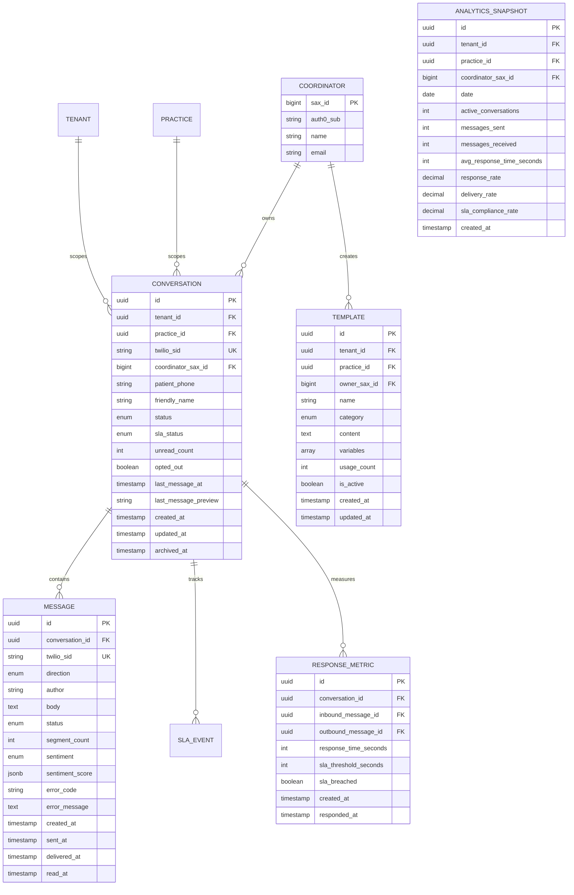
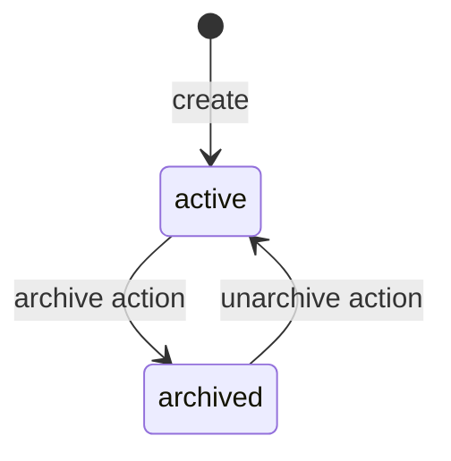
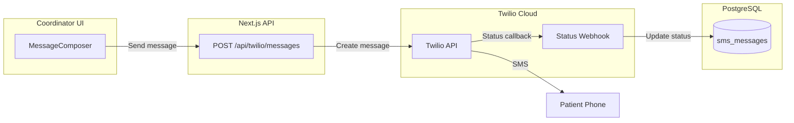
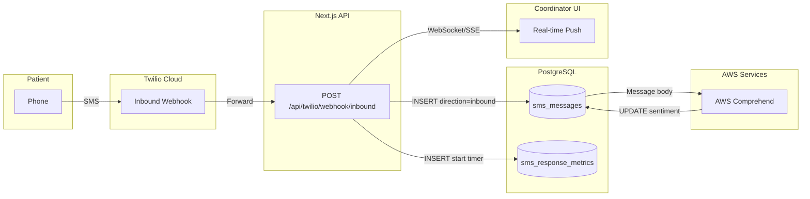
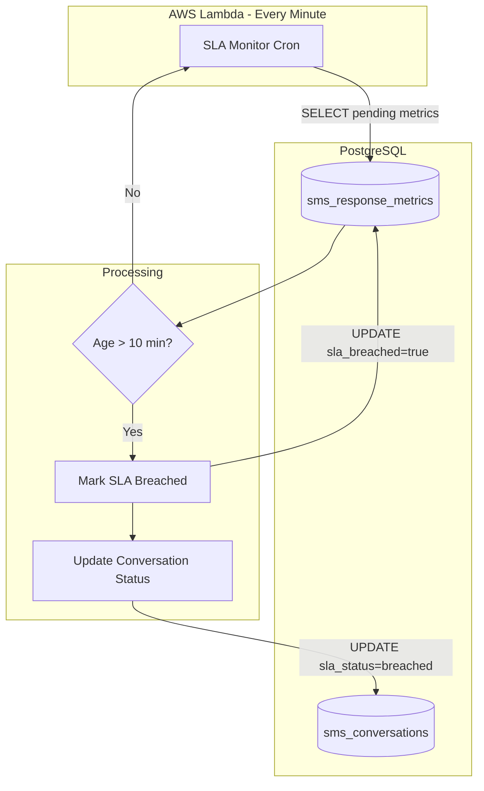

# Data Model: SMS Outreach Integration

**Feature**: 001-sms-outreach-integration  
**Date**: 2025-11-28  
**Storage**: PostgreSQL on RDS via AWS Lambda (NO DynamoDB)

This document defines the data entities, relationships, and validation rules for the SMS Outreach Integration feature.

---

## Entity Overview



---

## 1. Conversation

Represents an SMS thread between a coordinator and a patient.

### Fields

| Field | Type | Constraints | Description |
|-------|------|-------------|-------------|
| `id` | UUID | PK, auto-generated | Internal identifier |
| `tenant_id` | UUID | FK → tenants, NOT NULL | Tenant scope |
| `practice_id` | UUID | FK → practices, NOT NULL | Practice scope |
| `twilio_sid` | VARCHAR(34) | UNIQUE, NOT NULL | Twilio conversation SID |
| `coordinator_sax_id` | BIGINT | FK → people(sax_id), NOT NULL, indexed | SAX ID of the coordinator |
| `patient_phone` | VARCHAR(15) | NOT NULL | Patient phone number (+1XXXXXXXXXX) |
| `friendly_name` | VARCHAR(255) | NOT NULL | Display name for the conversation |
| `status` | ENUM | NOT NULL, default 'active' | 'active', 'archived' |
| `sla_status` | ENUM | NOT NULL, default 'ok' | 'ok', 'warning', 'breached' |
| `unread_count` | INTEGER | NOT NULL, default 0 | Number of unread patient messages |
| `opted_out` | BOOLEAN | NOT NULL, default false | Patient opted out via STOP message (FR-004a) |
| `last_message_at` | TIMESTAMPTZ | nullable | Timestamp of most recent message |
| `last_message_preview` | VARCHAR(160) | nullable | Truncated last message body |
| `created_on` | TIMESTAMPTZ | NOT NULL, default NOW() | Creation timestamp |
| `created_by` | BIGINT | nullable | SAX ID of creator |
| `updated_on` | TIMESTAMPTZ | NOT NULL, default NOW() | Last update timestamp |
| `updated_by` | BIGINT | nullable | SAX ID of updater |
| `archived_on` | TIMESTAMPTZ | nullable | When conversation was archived |
| `archived_by` | BIGINT | nullable | SAX ID of archiver |
| `active` | BOOLEAN | NOT NULL, default true | Soft delete flag |

### Indexes

```sql
CREATE INDEX idx_conversations_tenant_practice ON sms_conversations(tenant_id, practice_id);
CREATE INDEX idx_conversations_coordinator ON sms_conversations(coordinator_sax_id);
CREATE INDEX idx_conversations_status ON sms_conversations(tenant_id, practice_id, coordinator_sax_id, status);
CREATE INDEX idx_conversations_sla ON sms_conversations(coordinator_sax_id, sla_status) WHERE status = 'active' AND active = true;
CREATE INDEX idx_conversations_phone ON sms_conversations(patient_phone);
CREATE INDEX idx_conversations_last_message ON sms_conversations(last_message_at DESC) WHERE active = true;
```

### Validation Rules

- `patient_phone` must match regex `^\+1[0-9]{10}$` (US format only)
- `friendly_name` must be 1-255 characters
- Only one active conversation per `(tenant_id, practice_id, coordinator_sax_id, patient_phone)` pair

### State Transitions



---

## 2. Message

Individual SMS within a conversation.

### Fields

| Field | Type | Constraints | Description |
|-------|------|-------------|-------------|
| `id` | UUID | PK, auto-generated | Internal identifier |
| `tenant_id` | UUID | FK → tenants, NOT NULL | Tenant scope (denormalized for query performance) |
| `practice_id` | UUID | FK → practices, NOT NULL | Practice scope (denormalized for query performance) |
| `conversation_id` | UUID | FK → sms_conversations, NOT NULL | Parent conversation |
| `twilio_sid` | VARCHAR(34) | UNIQUE, NOT NULL | Twilio message SID |
| `direction` | ENUM | NOT NULL | 'inbound' (patient → system), 'outbound' (system → patient) |
| `author_sax_id` | BIGINT | nullable | SAX ID if outbound from coordinator |
| `author_phone` | VARCHAR(15) | nullable | Phone number if inbound from patient |
| `body` | TEXT | NOT NULL | Message content |
| `status` | ENUM | NOT NULL | 'sending', 'sent', 'delivered', 'read', 'failed' |
| `segment_count` | INTEGER | NOT NULL, default 1 | Number of SMS segments |
| `sentiment` | ENUM | nullable | 'positive', 'neutral', 'negative', 'mixed' |
| `sentiment_score` | JSONB | nullable | Detailed sentiment scores |
| `error_code` | VARCHAR(10) | nullable | Twilio error code if failed |
| `error_message` | TEXT | nullable | Error description if failed |
| `created_on` | TIMESTAMPTZ | NOT NULL, default NOW() | When message was created |
| `created_by` | BIGINT | nullable | SAX ID of creator |
| `sent_at` | TIMESTAMPTZ | nullable | When message was sent |
| `delivered_at` | TIMESTAMPTZ | nullable | When delivery confirmed |
| `read_at` | TIMESTAMPTZ | nullable | When read receipt received |
| `active` | BOOLEAN | NOT NULL, default true | Soft delete flag |

### Indexes

```sql
CREATE INDEX idx_messages_conversation ON sms_messages(conversation_id, created_at DESC);
CREATE INDEX idx_messages_twilio ON sms_messages(twilio_sid);
CREATE INDEX idx_messages_direction ON sms_messages(conversation_id, direction);
CREATE INDEX idx_messages_status ON sms_messages(status) WHERE status IN ('sending', 'failed');
```

### Validation Rules

- `body` must be non-empty
- `segment_count` calculated as: `CEIL(LENGTH(body) / 160)`

---

## 3. Template

Reusable message patterns with dynamic variables.

### Fields

| Field | Type | Constraints | Description |
|-------|------|-------------|-------------|
| `id` | UUID | PK, auto-generated | Internal identifier |
| `tenant_id` | UUID | FK → tenants, NOT NULL | Tenant scope |
| `practice_id` | UUID | FK → practices, nullable | NULL for tenant-wide, practice_id for practice-specific |
| `owner_sax_id` | BIGINT | nullable, indexed | NULL for global, SAX ID for private |
| `name` | VARCHAR(100) | NOT NULL | Template display name |
| `category` | ENUM | NOT NULL | 'welcome', 'reminder', 'follow-up', 'education', 'general' |
| `content` | TEXT | NOT NULL | Template body with `{{variable}}` placeholders |
| `variables` | TEXT[] | NOT NULL, default '{}' | Auto-detected variable names |
| `usage_count` | INTEGER | NOT NULL, default 0 | Number of times used |
| `created_on` | TIMESTAMPTZ | NOT NULL, default NOW() | Creation timestamp |
| `created_by` | BIGINT | nullable | SAX ID of creator |
| `updated_on` | TIMESTAMPTZ | NOT NULL, default NOW() | Last update timestamp |
| `updated_by` | BIGINT | nullable | SAX ID of updater |
| `archived_on` | TIMESTAMPTZ | nullable | When template was archived |
| `archived_by` | BIGINT | nullable | SAX ID of archiver |
| `active` | BOOLEAN | NOT NULL, default true | Soft delete flag |

### Indexes

```sql
CREATE INDEX idx_templates_tenant_practice ON sms_templates(tenant_id, practice_id);
CREATE INDEX idx_templates_owner ON sms_templates(owner_sax_id) WHERE active = true;
CREATE INDEX idx_templates_category ON sms_templates(tenant_id, category) WHERE active = true;
CREATE INDEX idx_templates_global ON sms_templates(tenant_id) WHERE owner_sax_id IS NULL AND active = true;
```

### Validation Rules

- `name` must be 1-100 characters, unique per owner
- `content` must be non-empty
- `variables` auto-extracted from `content` matching `\{\{(\w+)\}\}` pattern

### Visibility Rules

```text
owner_sax_id = NULL           → Global template (read-only for all coordinators in tenant)
owner_sax_id = coordinator    → Private template (full CRUD for owner only)
practice_id = NULL            → Tenant-wide template (visible to all practices)
practice_id = specific        → Practice-specific template
```

---

## 4. ResponseMetric

Tracks response times for SLA reporting and analytics.

### Fields

| Field | Type | Constraints | Description |
|-------|------|-------------|-------------|
| `id` | UUID | PK, auto-generated | Internal identifier |
| `conversation_id` | UUID | FK → sms_conversations, NOT NULL | Parent conversation |
| `inbound_message_id` | UUID | FK → sms_messages, NOT NULL | Patient message that triggered response |
| `outbound_message_id` | UUID | FK → sms_messages, nullable | Coordinator's response (NULL if no response) |
| `response_time_seconds` | INTEGER | nullable | Time to respond in seconds |
| `sla_threshold_seconds` | INTEGER | NOT NULL, default 600 | SLA threshold (10 minutes = 600s) |
| `sla_breached` | BOOLEAN | NOT NULL, default false | Whether SLA was breached |
| `created_at` | TIMESTAMPTZ | NOT NULL, default NOW() | When inbound message received |
| `responded_at` | TIMESTAMPTZ | nullable | When response was sent |

### Indexes

```sql
CREATE INDEX idx_metrics_conversation ON sms_response_metrics(conversation_id);
CREATE INDEX idx_metrics_sla ON sms_response_metrics(sla_breached, created_at);
CREATE INDEX idx_metrics_pending ON sms_response_metrics(conversation_id) 
  WHERE outbound_message_id IS NULL;
```

---

## 5. AnalyticsSnapshot

Pre-aggregated analytics data for dashboard performance.

### Fields

| Field | Type | Constraints | Description |
|-------|------|-------------|-------------|
| `id` | UUID | PK, auto-generated | Internal identifier |
| `tenant_id` | UUID | FK → tenants, NOT NULL | Tenant scope |
| `practice_id` | UUID | FK → practices, NOT NULL | Practice scope |
| `coordinator_sax_id` | BIGINT | NOT NULL, indexed | SAX ID of coordinator |
| `date` | DATE | NOT NULL | Snapshot date |
| `active_conversations` | INTEGER | NOT NULL, default 0 | Count of active conversations |
| `messages_sent` | INTEGER | NOT NULL, default 0 | Outbound messages |
| `messages_received` | INTEGER | NOT NULL, default 0 | Inbound messages |
| `avg_response_time_seconds` | INTEGER | nullable | Average response time |
| `response_rate` | DECIMAL(5,2) | nullable | Percentage of responses |
| `delivery_rate` | DECIMAL(5,2) | nullable | Percentage delivered |
| `sla_compliance_rate` | DECIMAL(5,2) | nullable | Percentage within SLA |
| `created_on` | TIMESTAMPTZ | NOT NULL, default NOW() | Snapshot creation time |

### Indexes

```sql
CREATE UNIQUE INDEX idx_analytics_coordinator_date ON sms_analytics_snapshots(tenant_id, practice_id, coordinator_sax_id, date);
CREATE INDEX idx_analytics_tenant_practice ON sms_analytics_snapshots(tenant_id, practice_id);
CREATE INDEX idx_analytics_date ON sms_analytics_snapshots(date);
```

---

## Database Schema (PostgreSQL DDL)

```sql
-- Enable UUID extension (already enabled in SAXDBDEV)
CREATE EXTENSION IF NOT EXISTS "uuid-ossp";

-- Enum types (prefixed with sms_ to avoid conflicts)
CREATE TYPE sms_conversation_status AS ENUM ('active', 'archived');
CREATE TYPE sms_sla_status AS ENUM ('ok', 'warning', 'breached');
CREATE TYPE sms_message_direction AS ENUM ('inbound', 'outbound');
CREATE TYPE sms_message_status AS ENUM ('sending', 'sent', 'delivered', 'read', 'failed');
CREATE TYPE sms_sentiment_type AS ENUM ('positive', 'neutral', 'negative', 'mixed');
CREATE TYPE sms_template_category AS ENUM ('welcome', 'reminder', 'follow-up', 'education', 'general');

-- Conversations table
CREATE TABLE sms_conversations (
  id UUID PRIMARY KEY DEFAULT uuid_generate_v4(),
  tenant_id UUID NOT NULL REFERENCES tenants(tenant_id),
  practice_id UUID NOT NULL REFERENCES practices(practice_id),
  twilio_sid VARCHAR(34) UNIQUE NOT NULL,
  coordinator_sax_id BIGINT NOT NULL,
  patient_phone VARCHAR(15) NOT NULL CHECK (patient_phone ~ '^\+1[0-9]{10}$'),
  friendly_name VARCHAR(255) NOT NULL,
  status sms_conversation_status NOT NULL DEFAULT 'active',
  sla_status sms_sla_status NOT NULL DEFAULT 'ok',
  unread_count INTEGER NOT NULL DEFAULT 0 CHECK (unread_count >= 0),
  last_message_at TIMESTAMPTZ,
  last_message_preview VARCHAR(160),
  created_on TIMESTAMPTZ NOT NULL DEFAULT NOW(),
  created_by BIGINT,
  updated_on TIMESTAMPTZ NOT NULL DEFAULT NOW(),
  updated_by BIGINT,
  archived_on TIMESTAMPTZ,
  archived_by BIGINT,
  active BOOLEAN NOT NULL DEFAULT true,
  UNIQUE (tenant_id, practice_id, coordinator_sax_id, patient_phone, status)
);

-- Messages table
CREATE TABLE sms_messages (
  id UUID PRIMARY KEY DEFAULT uuid_generate_v4(),
  tenant_id UUID NOT NULL REFERENCES tenants(tenant_id),
  practice_id UUID NOT NULL REFERENCES practices(practice_id),
  conversation_id UUID NOT NULL REFERENCES sms_conversations(id) ON DELETE CASCADE,
  twilio_sid VARCHAR(34) UNIQUE NOT NULL,
  direction sms_message_direction NOT NULL,
  author_sax_id BIGINT, -- NULL for inbound messages
  author_phone VARCHAR(15), -- NULL for outbound messages
  body TEXT NOT NULL CHECK (LENGTH(body) > 0),
  status sms_message_status NOT NULL DEFAULT 'sending',
  segment_count INTEGER NOT NULL DEFAULT 1 CHECK (segment_count > 0),
  sentiment sms_sentiment_type,
  sentiment_score JSONB,
  error_code VARCHAR(10),
  error_message TEXT,
  created_on TIMESTAMPTZ NOT NULL DEFAULT NOW(),
  created_by BIGINT,
  sent_at TIMESTAMPTZ,
  delivered_at TIMESTAMPTZ,
  read_at TIMESTAMPTZ,
  active BOOLEAN NOT NULL DEFAULT true
);

-- Templates table
CREATE TABLE sms_templates (
  id UUID PRIMARY KEY DEFAULT uuid_generate_v4(),
  tenant_id UUID NOT NULL REFERENCES tenants(tenant_id),
  practice_id UUID REFERENCES practices(practice_id), -- NULL for tenant-wide
  owner_sax_id BIGINT, -- NULL for global templates
  name VARCHAR(100) NOT NULL,
  category sms_template_category NOT NULL DEFAULT 'general',
  content TEXT NOT NULL CHECK (LENGTH(content) > 0),
  variables TEXT[] NOT NULL DEFAULT '{}',
  usage_count INTEGER NOT NULL DEFAULT 0 CHECK (usage_count >= 0),
  created_on TIMESTAMPTZ NOT NULL DEFAULT NOW(),
  created_by BIGINT,
  updated_on TIMESTAMPTZ NOT NULL DEFAULT NOW(),
  updated_by BIGINT,
  archived_on TIMESTAMPTZ,
  archived_by BIGINT,
  active BOOLEAN NOT NULL DEFAULT true,
  UNIQUE (tenant_id, owner_sax_id, name)
);

-- Response metrics table
CREATE TABLE sms_response_metrics (
  id UUID PRIMARY KEY DEFAULT uuid_generate_v4(),
  tenant_id UUID NOT NULL REFERENCES tenants(tenant_id),
  practice_id UUID NOT NULL REFERENCES practices(practice_id),
  conversation_id UUID NOT NULL REFERENCES sms_conversations(id) ON DELETE CASCADE,
  inbound_message_id UUID NOT NULL REFERENCES sms_messages(id) ON DELETE CASCADE,
  outbound_message_id UUID REFERENCES sms_messages(id) ON DELETE SET NULL,
  response_time_seconds INTEGER CHECK (response_time_seconds >= 0),
  sla_threshold_seconds INTEGER NOT NULL DEFAULT 600,
  sla_breached BOOLEAN NOT NULL DEFAULT false,
  created_on TIMESTAMPTZ NOT NULL DEFAULT NOW(),
  responded_at TIMESTAMPTZ
);

-- Analytics snapshots table
CREATE TABLE sms_analytics_snapshots (
  id UUID PRIMARY KEY DEFAULT uuid_generate_v4(),
  tenant_id UUID NOT NULL REFERENCES tenants(tenant_id),
  practice_id UUID NOT NULL REFERENCES practices(practice_id),
  coordinator_sax_id BIGINT NOT NULL,
  date DATE NOT NULL,
  active_conversations INTEGER NOT NULL DEFAULT 0,
  messages_sent INTEGER NOT NULL DEFAULT 0,
  messages_received INTEGER NOT NULL DEFAULT 0,
  avg_response_time_seconds INTEGER,
  response_rate DECIMAL(5,2) CHECK (response_rate >= 0 AND response_rate <= 100),
  delivery_rate DECIMAL(5,2) CHECK (delivery_rate >= 0 AND delivery_rate <= 100),
  sla_compliance_rate DECIMAL(5,2) CHECK (sla_compliance_rate >= 0 AND sla_compliance_rate <= 100),
  created_on TIMESTAMPTZ NOT NULL DEFAULT NOW(),
  UNIQUE (tenant_id, practice_id, coordinator_sax_id, date)
);

-- Create all indexes
CREATE INDEX idx_sms_conversations_tenant_practice ON sms_conversations(tenant_id, practice_id);
CREATE INDEX idx_sms_conversations_coordinator ON sms_conversations(coordinator_sax_id);
CREATE INDEX idx_sms_conversations_status ON sms_conversations(tenant_id, practice_id, coordinator_sax_id, status) WHERE active = true;
CREATE INDEX idx_sms_conversations_sla ON sms_conversations(coordinator_sax_id, sla_status) WHERE status = 'active' AND active = true;
CREATE INDEX idx_sms_conversations_phone ON sms_conversations(patient_phone);
CREATE INDEX idx_sms_conversations_last_message ON sms_conversations(last_message_at DESC) WHERE active = true;

CREATE INDEX idx_sms_messages_tenant_practice ON sms_messages(tenant_id, practice_id);
CREATE INDEX idx_sms_messages_conversation ON sms_messages(conversation_id, created_on DESC);
CREATE INDEX idx_sms_messages_twilio ON sms_messages(twilio_sid);
CREATE INDEX idx_sms_messages_direction ON sms_messages(conversation_id, direction);
CREATE INDEX idx_sms_messages_status ON sms_messages(status) WHERE status IN ('sending', 'failed');

CREATE INDEX idx_sms_templates_tenant_practice ON sms_templates(tenant_id, practice_id);
CREATE INDEX idx_sms_templates_owner ON sms_templates(owner_sax_id) WHERE active = true;
CREATE INDEX idx_sms_templates_category ON sms_templates(tenant_id, category) WHERE active = true;
CREATE INDEX idx_sms_templates_global ON sms_templates(tenant_id) WHERE owner_sax_id IS NULL AND active = true;

CREATE INDEX idx_sms_metrics_tenant_practice ON sms_response_metrics(tenant_id, practice_id);
CREATE INDEX idx_sms_metrics_conversation ON sms_response_metrics(conversation_id);
CREATE INDEX idx_sms_metrics_sla ON sms_response_metrics(sla_breached, created_on);
CREATE INDEX idx_sms_metrics_pending ON sms_response_metrics(conversation_id) WHERE outbound_message_id IS NULL;

CREATE INDEX idx_sms_analytics_tenant_practice ON sms_analytics_snapshots(tenant_id, practice_id);
CREATE INDEX idx_sms_analytics_coordinator_date ON sms_analytics_snapshots(tenant_id, practice_id, coordinator_sax_id, date);
CREATE INDEX idx_sms_analytics_date ON sms_analytics_snapshots(date);

-- Trigger for updated_on (uses existing function from SAXDBDEV if available)
CREATE OR REPLACE FUNCTION sms_update_updated_on_column()
RETURNS TRIGGER AS $$
BEGIN
  NEW.updated_on = NOW();
  RETURN NEW;
END;
$$ language 'plpgsql';

CREATE TRIGGER trg_sms_conversations_updated_on
  BEFORE UPDATE ON sms_conversations
  FOR EACH ROW EXECUTE FUNCTION sms_update_updated_on_column();

CREATE TRIGGER trg_sms_templates_updated_on
  BEFORE UPDATE ON sms_templates
  FOR EACH ROW EXECUTE FUNCTION sms_update_updated_on_column();
```

---

## TypeScript Types

```typescript
// types/sms.ts

export type ConversationStatus = 'active' | 'archived';
export type SlaStatus = 'ok' | 'warning' | 'breached';
export type MessageDirection = 'inbound' | 'outbound';
export type MessageStatus = 'sending' | 'sent' | 'delivered' | 'read' | 'failed';
export type Sentiment = 'positive' | 'neutral' | 'negative' | 'mixed';
export type TemplateCategory = 'welcome' | 'reminder' | 'follow-up' | 'education' | 'general';

// Common audit fields used across all entities
export interface AuditFields {
  createdOn: string;
  createdBy: number | null;
  updatedOn: string;
  updatedBy: number | null;
  archivedOn: string | null;
  archivedBy: number | null;
  active: boolean;
}

// Multi-tenancy scope
export interface TenantScope {
  tenantId: string;
  practiceId: string;
}

export interface Conversation extends TenantScope, AuditFields {
  id: string;
  twilioSid: string;
  coordinatorSaxId: number;
  patientPhone: string;
  friendlyName: string;
  status: ConversationStatus;
  slaStatus: SlaStatus;
  unreadCount: number;
  lastMessageAt: string | null;
  lastMessagePreview: string | null;
}

export interface Message extends TenantScope {
  id: string;
  conversationId: string;
  twilioSid: string;
  direction: MessageDirection;
  authorSaxId: number | null;
  authorPhone: string | null;
  body: string;
  status: MessageStatus;
  segmentCount: number;
  sentiment: Sentiment | null;
  sentimentScore: Record<string, number> | null;
  errorCode: string | null;
  errorMessage: string | null;
  createdOn: string;
  createdBy: number | null;
  sentAt: string | null;
  deliveredAt: string | null;
  readAt: string | null;
  active: boolean;
}

export interface Template extends TenantScope, AuditFields {
  id: string;
  practiceId: string | null; // Nullable for tenant-wide templates
  ownerSaxId: number | null;
  name: string;
  category: TemplateCategory;
  content: string;
  variables: string[];
  usageCount: number;
}

export interface ResponseMetric extends TenantScope {
  id: string;
  conversationId: string;
  inboundMessageId: string;
  outboundMessageId: string | null;
  responseTimeSeconds: number | null;
  slaThresholdSeconds: number;
  slaBreached: boolean;
  createdOn: string;
  respondedAt: string | null;
}

export interface AnalyticsSnapshot extends TenantScope {
  id: string;
  coordinatorSaxId: number;
  date: string;
  activeConversations: number;
  messagesSent: number;
  messagesReceived: number;
  avgResponseTimeSeconds: number | null;
  responseRate: number | null;
  deliveryRate: number | null;
  slaComplianceRate: number | null;
  createdOn: string;
}
```

---

## Data Flow Diagrams

### Message Send Flow



### Message Receive Flow



### SLA Monitoring Flow



---

## 7. Database Functions

All functions follow SAXDBDEV conventions:

- Return types use `RETURNS TABLE(...)` for structured data
- Use `LANGUAGE plpgsql` with proper exception handling
- Include `COMMENT ON FUNCTION` documentation
- Tenant/practice scoping on all queries
- Audit columns populated by function parameters

### 7.1 Conversation Functions

```sql
-- ============================================================================
-- Function: insert_sms_conversation
-- Purpose: Create a new SMS conversation thread
-- Returns: New conversation_id and initial metadata
-- ============================================================================

CREATE OR REPLACE FUNCTION public.insert_sms_conversation(
    p_tenant_id UUID,
    p_practice_id UUID,
    p_coordinator_sax_id BIGINT,
    p_patient_phone VARCHAR(20),
    p_patient_sax_id BIGINT DEFAULT NULL,
    p_patient_name VARCHAR(255) DEFAULT NULL,
    p_twilio_sid VARCHAR(64) DEFAULT NULL,
    p_metadata JSONB DEFAULT '{}'::jsonb,
    p_created_by BIGINT
)
RETURNS TABLE(
    out_conversation_id UUID,
    out_status sms_conversation_status,
    out_created_on TIMESTAMP
) AS $$
DECLARE
    v_conversation_id UUID;
    v_created_on TIMESTAMP;
BEGIN
    INSERT INTO public.sms_conversations (
        conversation_id,
        tenant_id,
        practice_id,
        coordinator_sax_id,
        patient_phone,
        patient_sax_id,
        patient_name,
        twilio_conversation_sid,
        status,
        metadata,
        created_on,
        created_by,
        updated_on,
        updated_by,
        active
    ) VALUES (
        gen_random_uuid(),
        p_tenant_id,
        p_practice_id,
        p_coordinator_sax_id,
        p_patient_phone,
        p_patient_sax_id,
        p_patient_name,
        p_twilio_sid,
        'active',
        p_metadata,
        CURRENT_TIMESTAMP,
        p_created_by,
        CURRENT_TIMESTAMP,
        p_created_by,
        true
    )
    RETURNING conversation_id, created_on 
    INTO v_conversation_id, v_created_on;

    RETURN QUERY SELECT v_conversation_id, 'active'::sms_conversation_status, v_created_on;
END;
$$ LANGUAGE plpgsql;

COMMENT ON FUNCTION public.insert_sms_conversation IS
'Creates a new SMS conversation thread between a coordinator and patient. Returns the new conversation_id and initial status.';


-- ============================================================================
-- Function: get_sms_conversation_by_id
-- Purpose: Retrieve a single conversation with tenant scoping
-- Returns: Full conversation record
-- ============================================================================

CREATE OR REPLACE FUNCTION public.get_sms_conversation_by_id(
    p_conversation_id UUID,
    p_tenant_id UUID,
    p_practice_id UUID DEFAULT NULL
)
RETURNS TABLE(
    out_conversation_id UUID,
    out_coordinator_sax_id BIGINT,
    out_patient_phone VARCHAR(20),
    out_patient_sax_id BIGINT,
    out_patient_name VARCHAR(255),
    out_twilio_conversation_sid VARCHAR(64),
    out_status sms_conversation_status,
    out_sla_status sms_sla_status,
    out_last_message_at TIMESTAMP,
    out_unread_count INTEGER,
    out_metadata JSONB,
    out_created_on TIMESTAMP,
    out_active BOOLEAN
) AS $$
BEGIN
    RETURN QUERY
    SELECT 
        c.conversation_id,
        c.coordinator_sax_id,
        c.patient_phone,
        c.patient_sax_id,
        c.patient_name,
        c.twilio_conversation_sid,
        c.status,
        c.sla_status,
        c.last_message_at,
        c.unread_count,
        c.metadata,
        c.created_on,
        c.active
    FROM public.sms_conversations c
    WHERE c.conversation_id = p_conversation_id
      AND c.tenant_id = p_tenant_id
      AND (p_practice_id IS NULL OR c.practice_id = p_practice_id)
      AND c.active = true;
END;
$$ LANGUAGE plpgsql;

COMMENT ON FUNCTION public.get_sms_conversation_by_id IS
'Retrieves a single SMS conversation by ID with tenant/practice scoping. Returns NULL if not found or inactive.';


-- ============================================================================
-- Function: get_sms_conversations_for_coordinator
-- Purpose: List conversations for a coordinator with pagination
-- Returns: Paginated list of conversations ordered by last activity
-- ============================================================================

CREATE OR REPLACE FUNCTION public.get_sms_conversations_for_coordinator(
    p_coordinator_sax_id BIGINT,
    p_tenant_id UUID,
    p_practice_id UUID DEFAULT NULL,
    p_status sms_conversation_status DEFAULT NULL,
    p_sla_status sms_sla_status DEFAULT NULL,
    p_limit INTEGER DEFAULT 50,
    p_offset INTEGER DEFAULT 0
)
RETURNS TABLE(
    out_conversation_id UUID,
    out_patient_phone VARCHAR(20),
    out_patient_name VARCHAR(255),
    out_status sms_conversation_status,
    out_sla_status sms_sla_status,
    out_last_message_at TIMESTAMP,
    out_unread_count INTEGER,
    out_total_count BIGINT
) AS $$
BEGIN
    RETURN QUERY
    WITH filtered AS (
        SELECT 
            c.conversation_id,
            c.patient_phone,
            c.patient_name,
            c.status,
            c.sla_status,
            c.last_message_at,
            c.unread_count
        FROM public.sms_conversations c
        WHERE c.coordinator_sax_id = p_coordinator_sax_id
          AND c.tenant_id = p_tenant_id
          AND (p_practice_id IS NULL OR c.practice_id = p_practice_id)
          AND (p_status IS NULL OR c.status = p_status)
          AND (p_sla_status IS NULL OR c.sla_status = p_sla_status)
          AND c.active = true
    )
    SELECT 
        f.conversation_id,
        f.patient_phone,
        f.patient_name,
        f.status,
        f.sla_status,
        f.last_message_at,
        f.unread_count,
        COUNT(*) OVER() as total_count
    FROM filtered f
    ORDER BY f.last_message_at DESC NULLS LAST
    LIMIT p_limit
    OFFSET p_offset;
END;
$$ LANGUAGE plpgsql;

COMMENT ON FUNCTION public.get_sms_conversations_for_coordinator IS
'Lists conversations for a coordinator with optional status filters and pagination. Results ordered by most recent activity.';


-- ============================================================================
-- Function: update_sms_conversation_status
-- Purpose: Update conversation status and SLA status
-- Returns: Updated record metadata
-- ============================================================================

CREATE OR REPLACE FUNCTION public.update_sms_conversation_status(
    p_conversation_id UUID,
    p_tenant_id UUID,
    p_status sms_conversation_status DEFAULT NULL,
    p_sla_status sms_sla_status DEFAULT NULL,
    p_updated_by BIGINT
)
RETURNS TABLE(
    out_conversation_id UUID,
    out_status sms_conversation_status,
    out_sla_status sms_sla_status,
    out_updated_on TIMESTAMP
) AS $$
DECLARE
    v_updated_on TIMESTAMP;
BEGIN
    UPDATE public.sms_conversations
    SET
        status = COALESCE(p_status, status),
        sla_status = COALESCE(p_sla_status, sla_status),
        updated_on = CURRENT_TIMESTAMP,
        updated_by = p_updated_by
    WHERE conversation_id = p_conversation_id
      AND tenant_id = p_tenant_id
      AND active = true
    RETURNING updated_on INTO v_updated_on;

    IF NOT FOUND THEN
        RAISE EXCEPTION 'Conversation % not found or inactive', p_conversation_id;
    END IF;

    RETURN QUERY
    SELECT 
        c.conversation_id, c.status, c.sla_status, c.updated_on
    FROM public.sms_conversations c
    WHERE c.conversation_id = p_conversation_id;
END;
$$ LANGUAGE plpgsql;

COMMENT ON FUNCTION public.update_sms_conversation_status IS
'Updates conversation status and/or SLA status. Uses COALESCE to only update provided values.';


-- ============================================================================
-- Function: archive_sms_conversation
-- Purpose: Soft-delete a conversation (set active=false)
-- Returns: Archived record metadata
-- ============================================================================

CREATE OR REPLACE FUNCTION public.archive_sms_conversation(
    p_conversation_id UUID,
    p_tenant_id UUID,
    p_archived_by BIGINT
)
RETURNS TABLE(
    out_conversation_id UUID,
    out_archived_on TIMESTAMP,
    out_was_already_archived BOOLEAN
) AS $$
DECLARE
    v_active BOOLEAN;
    v_archived_on TIMESTAMP;
BEGIN
    SELECT active, archived_on INTO v_active, v_archived_on
    FROM public.sms_conversations
    WHERE conversation_id = p_conversation_id
      AND tenant_id = p_tenant_id;

    IF NOT FOUND THEN
        RAISE EXCEPTION 'Conversation % not found', p_conversation_id;
    END IF;

    -- Idempotency: already archived
    IF v_active = false THEN
        RETURN QUERY SELECT p_conversation_id, v_archived_on, true;
        RETURN;
    END IF;

    UPDATE public.sms_conversations
    SET
        active = false,
        archived_on = CURRENT_TIMESTAMP,
        archived_by = p_archived_by,
        updated_on = CURRENT_TIMESTAMP,
        updated_by = p_archived_by
    WHERE conversation_id = p_conversation_id
    RETURNING archived_on INTO v_archived_on;

    RETURN QUERY SELECT p_conversation_id, v_archived_on, false;
END;
$$ LANGUAGE plpgsql;

COMMENT ON FUNCTION public.archive_sms_conversation IS
'Soft-deletes a conversation. Idempotent: returns success if already archived.';
```

### 7.2 Message Functions

```sql
-- ============================================================================
-- Function: insert_sms_message
-- Purpose: Insert a new message and update conversation metadata
-- Returns: New message_id and processing status
-- ============================================================================

CREATE OR REPLACE FUNCTION public.insert_sms_message(
    p_conversation_id UUID,
    p_tenant_id UUID,
    p_twilio_message_sid VARCHAR(64),
    p_direction sms_message_direction,
    p_body TEXT,
    p_from_phone VARCHAR(20),
    p_to_phone VARCHAR(20),
    p_sender_sax_id BIGINT DEFAULT NULL,
    p_media_urls TEXT[] DEFAULT NULL,
    p_status sms_message_status DEFAULT 'sent',
    p_created_by BIGINT
)
RETURNS TABLE(
    out_message_id UUID,
    out_direction sms_message_direction,
    out_status sms_message_status,
    out_created_on TIMESTAMP
) AS $$
DECLARE
    v_message_id UUID;
    v_created_on TIMESTAMP;
BEGIN
    -- Validate conversation exists and belongs to tenant
    IF NOT EXISTS (
        SELECT 1 FROM public.sms_conversations 
        WHERE conversation_id = p_conversation_id 
          AND tenant_id = p_tenant_id 
          AND active = true
    ) THEN
        RAISE EXCEPTION 'Conversation % not found or inactive', p_conversation_id;
    END IF;

    -- Insert the message
    INSERT INTO public.sms_messages (
        message_id,
        conversation_id,
        tenant_id,
        twilio_message_sid,
        direction,
        body,
        from_phone,
        to_phone,
        sender_sax_id,
        media_urls,
        status,
        created_on,
        created_by,
        updated_on,
        updated_by,
        active
    ) VALUES (
        gen_random_uuid(),
        p_conversation_id,
        p_tenant_id,
        p_twilio_message_sid,
        p_direction,
        p_body,
        p_from_phone,
        p_to_phone,
        p_sender_sax_id,
        p_media_urls,
        p_status,
        CURRENT_TIMESTAMP,
        p_created_by,
        CURRENT_TIMESTAMP,
        p_created_by,
        true
    )
    RETURNING message_id, created_on INTO v_message_id, v_created_on;

    -- Update conversation last_message_at and unread_count
    UPDATE public.sms_conversations
    SET
        last_message_at = v_created_on,
        unread_count = CASE 
            WHEN p_direction = 'inbound' THEN unread_count + 1 
            ELSE unread_count 
        END,
        updated_on = v_created_on,
        updated_by = p_created_by
    WHERE conversation_id = p_conversation_id;

    RETURN QUERY SELECT v_message_id, p_direction, p_status, v_created_on;
END;
$$ LANGUAGE plpgsql;

COMMENT ON FUNCTION public.insert_sms_message IS
'Inserts a new SMS message and updates the parent conversation metadata (last_message_at, unread_count).';


-- ============================================================================
-- Function: get_sms_messages_for_conversation
-- Purpose: Retrieve messages for a conversation with pagination
-- Returns: Paginated list of messages ordered by creation time
-- ============================================================================

CREATE OR REPLACE FUNCTION public.get_sms_messages_for_conversation(
    p_conversation_id UUID,
    p_tenant_id UUID,
    p_limit INTEGER DEFAULT 50,
    p_offset INTEGER DEFAULT 0,
    p_include_archived BOOLEAN DEFAULT false
)
RETURNS TABLE(
    out_message_id UUID,
    out_direction sms_message_direction,
    out_body TEXT,
    out_from_phone VARCHAR(20),
    out_to_phone VARCHAR(20),
    out_sender_sax_id BIGINT,
    out_status sms_message_status,
    out_sentiment_score DECIMAL(3,2),
    out_sentiment_label sms_sentiment_label,
    out_media_urls TEXT[],
    out_created_on TIMESTAMP,
    out_total_count BIGINT
) AS $$
BEGIN
    RETURN QUERY
    WITH messages AS (
        SELECT 
            m.message_id,
            m.direction,
            m.body,
            m.from_phone,
            m.to_phone,
            m.sender_sax_id,
            m.status,
            m.sentiment_score,
            m.sentiment_label,
            m.media_urls,
            m.created_on
        FROM public.sms_messages m
        WHERE m.conversation_id = p_conversation_id
          AND m.tenant_id = p_tenant_id
          AND (p_include_archived OR m.active = true)
    )
    SELECT 
        msg.message_id,
        msg.direction,
        msg.body,
        msg.from_phone,
        msg.to_phone,
        msg.sender_sax_id,
        msg.status,
        msg.sentiment_score,
        msg.sentiment_label,
        msg.media_urls,
        msg.created_on,
        COUNT(*) OVER() as total_count
    FROM messages msg
    ORDER BY msg.created_on ASC
    LIMIT p_limit
    OFFSET p_offset;
END;
$$ LANGUAGE plpgsql;

COMMENT ON FUNCTION public.get_sms_messages_for_conversation IS
'Retrieves paginated messages for a conversation. Ordered chronologically (oldest first).';


-- ============================================================================
-- Function: update_sms_message_sentiment
-- Purpose: Update message with sentiment analysis results
-- Returns: Updated message metadata
-- ============================================================================

CREATE OR REPLACE FUNCTION public.update_sms_message_sentiment(
    p_message_id UUID,
    p_tenant_id UUID,
    p_sentiment_score DECIMAL(3,2),
    p_sentiment_label sms_sentiment_label,
    p_sentiment_analyzed_at TIMESTAMP DEFAULT CURRENT_TIMESTAMP,
    p_updated_by BIGINT
)
RETURNS TABLE(
    out_message_id UUID,
    out_sentiment_score DECIMAL(3,2),
    out_sentiment_label sms_sentiment_label,
    out_updated_on TIMESTAMP
) AS $$
BEGIN
    UPDATE public.sms_messages
    SET
        sentiment_score = p_sentiment_score,
        sentiment_label = p_sentiment_label,
        sentiment_analyzed_at = p_sentiment_analyzed_at,
        updated_on = CURRENT_TIMESTAMP,
        updated_by = p_updated_by
    WHERE message_id = p_message_id
      AND tenant_id = p_tenant_id
      AND active = true;

    IF NOT FOUND THEN
        RAISE EXCEPTION 'Message % not found or inactive', p_message_id;
    END IF;

    RETURN QUERY
    SELECT 
        m.message_id, m.sentiment_score, m.sentiment_label, m.updated_on
    FROM public.sms_messages m
    WHERE m.message_id = p_message_id;
END;
$$ LANGUAGE plpgsql;

COMMENT ON FUNCTION public.update_sms_message_sentiment IS
'Updates a message with sentiment analysis results from AWS Comprehend or similar service.';


-- ============================================================================
-- Function: mark_sms_conversation_read
-- Purpose: Reset unread count for a conversation
-- Returns: Updated unread count (should be 0)
-- ============================================================================

CREATE OR REPLACE FUNCTION public.mark_sms_conversation_read(
    p_conversation_id UUID,
    p_tenant_id UUID,
    p_updated_by BIGINT
)
RETURNS TABLE(
    out_conversation_id UUID,
    out_unread_count INTEGER,
    out_updated_on TIMESTAMP
) AS $$
BEGIN
    UPDATE public.sms_conversations
    SET
        unread_count = 0,
        updated_on = CURRENT_TIMESTAMP,
        updated_by = p_updated_by
    WHERE conversation_id = p_conversation_id
      AND tenant_id = p_tenant_id
      AND active = true;

    IF NOT FOUND THEN
        RAISE EXCEPTION 'Conversation % not found or inactive', p_conversation_id;
    END IF;

    RETURN QUERY
    SELECT p_conversation_id, 0, CURRENT_TIMESTAMP;
END;
$$ LANGUAGE plpgsql;

COMMENT ON FUNCTION public.mark_sms_conversation_read IS
'Marks all messages in a conversation as read by resetting unread_count to 0.';
```

### 7.3 Template Functions

```sql
-- ============================================================================
-- Function: insert_sms_template
-- Purpose: Create a new message template
-- Returns: New template_id and metadata
-- ============================================================================

CREATE OR REPLACE FUNCTION public.insert_sms_template(
    p_tenant_id UUID,
    p_practice_id UUID DEFAULT NULL,
    p_name VARCHAR(100),
    p_body TEXT,
    p_category VARCHAR(50) DEFAULT 'general',
    p_variables TEXT[] DEFAULT NULL,
    p_is_global BOOLEAN DEFAULT false,
    p_created_by BIGINT
)
RETURNS TABLE(
    out_template_id UUID,
    out_name VARCHAR(100),
    out_is_global BOOLEAN,
    out_created_on TIMESTAMP
) AS $$
DECLARE
    v_template_id UUID;
    v_created_on TIMESTAMP;
BEGIN
    INSERT INTO public.sms_templates (
        template_id,
        tenant_id,
        practice_id,
        name,
        body,
        category,
        variables,
        is_global,
        created_on,
        created_by,
        updated_on,
        updated_by,
        active
    ) VALUES (
        gen_random_uuid(),
        p_tenant_id,
        p_practice_id,
        p_name,
        p_body,
        p_category,
        p_variables,
        p_is_global,
        CURRENT_TIMESTAMP,
        p_created_by,
        CURRENT_TIMESTAMP,
        p_created_by,
        true
    )
    RETURNING template_id, created_on INTO v_template_id, v_created_on;

    RETURN QUERY SELECT v_template_id, p_name, p_is_global, v_created_on;
END;
$$ LANGUAGE plpgsql;

COMMENT ON FUNCTION public.insert_sms_template IS
'Creates a new SMS template. Set is_global=true for tenant-wide templates, or provide practice_id for practice-specific.';


-- ============================================================================
-- Function: get_sms_templates
-- Purpose: List available templates for a practice/tenant
-- Returns: List of templates ordered by category and name
-- ============================================================================

CREATE OR REPLACE FUNCTION public.get_sms_templates(
    p_tenant_id UUID,
    p_practice_id UUID DEFAULT NULL,
    p_category VARCHAR(50) DEFAULT NULL,
    p_include_global BOOLEAN DEFAULT true
)
RETURNS TABLE(
    out_template_id UUID,
    out_name VARCHAR(100),
    out_body TEXT,
    out_category VARCHAR(50),
    out_variables TEXT[],
    out_is_global BOOLEAN,
    out_usage_count INTEGER
) AS $$
BEGIN
    RETURN QUERY
    SELECT 
        t.template_id,
        t.name,
        t.body,
        t.category,
        t.variables,
        t.is_global,
        t.usage_count
    FROM public.sms_templates t
    WHERE t.tenant_id = p_tenant_id
      AND t.active = true
      AND (p_category IS NULL OR t.category = p_category)
      AND (
          -- Practice-specific templates
          (t.practice_id = p_practice_id AND t.is_global = false)
          OR
          -- Global templates if requested
          (p_include_global AND t.is_global = true)
      )
    ORDER BY t.category, t.name;
END;
$$ LANGUAGE plpgsql;

COMMENT ON FUNCTION public.get_sms_templates IS
'Lists SMS templates available for a practice, optionally including tenant-wide global templates.';


-- ============================================================================
-- Function: update_sms_template
-- Purpose: Update template content
-- Returns: Updated template metadata
-- ============================================================================

CREATE OR REPLACE FUNCTION public.update_sms_template(
    p_template_id UUID,
    p_tenant_id UUID,
    p_name VARCHAR(100) DEFAULT NULL,
    p_body TEXT DEFAULT NULL,
    p_category VARCHAR(50) DEFAULT NULL,
    p_variables TEXT[] DEFAULT NULL,
    p_updated_by BIGINT
)
RETURNS TABLE(
    out_template_id UUID,
    out_name VARCHAR(100),
    out_updated_on TIMESTAMP
) AS $$
BEGIN
    UPDATE public.sms_templates
    SET
        name = COALESCE(p_name, name),
        body = COALESCE(p_body, body),
        category = COALESCE(p_category, category),
        variables = COALESCE(p_variables, variables),
        updated_on = CURRENT_TIMESTAMP,
        updated_by = p_updated_by
    WHERE template_id = p_template_id
      AND tenant_id = p_tenant_id
      AND active = true;

    IF NOT FOUND THEN
        RAISE EXCEPTION 'Template % not found or inactive', p_template_id;
    END IF;

    RETURN QUERY
    SELECT t.template_id, t.name, t.updated_on
    FROM public.sms_templates t
    WHERE t.template_id = p_template_id;
END;
$$ LANGUAGE plpgsql;

COMMENT ON FUNCTION public.update_sms_template IS
'Updates SMS template content. Uses COALESCE to only update provided fields.';


-- ============================================================================
-- Function: increment_sms_template_usage
-- Purpose: Track template usage for analytics
-- Returns: New usage count
-- ============================================================================

CREATE OR REPLACE FUNCTION public.increment_sms_template_usage(
    p_template_id UUID,
    p_tenant_id UUID
)
RETURNS INTEGER AS $$
DECLARE
    v_new_count INTEGER;
BEGIN
    UPDATE public.sms_templates
    SET
        usage_count = usage_count + 1,
        last_used_at = CURRENT_TIMESTAMP
    WHERE template_id = p_template_id
      AND tenant_id = p_tenant_id
      AND active = true
    RETURNING usage_count INTO v_new_count;

    RETURN v_new_count;
END;
$$ LANGUAGE plpgsql;

COMMENT ON FUNCTION public.increment_sms_template_usage IS
'Increments template usage counter. Called when a template is used to send a message.';
```

### 7.4 SLA Monitoring Functions

```sql
-- ============================================================================
-- Function: insert_sms_response_metric
-- Purpose: Start tracking response time for an inbound message
-- Returns: New metric_id
-- ============================================================================

CREATE OR REPLACE FUNCTION public.insert_sms_response_metric(
    p_conversation_id UUID,
    p_tenant_id UUID,
    p_practice_id UUID,
    p_inbound_message_id UUID,
    p_sla_threshold_seconds INTEGER DEFAULT 600,
    p_created_by BIGINT
)
RETURNS TABLE(
    out_metric_id UUID,
    out_inbound_at TIMESTAMP,
    out_sla_threshold_seconds INTEGER
) AS $$
DECLARE
    v_metric_id UUID;
    v_inbound_at TIMESTAMP;
BEGIN
    INSERT INTO public.sms_response_metrics (
        metric_id,
        conversation_id,
        tenant_id,
        practice_id,
        inbound_message_id,
        inbound_at,
        sla_threshold_seconds,
        sla_breached,
        created_on,
        created_by,
        updated_on,
        updated_by,
        active
    ) VALUES (
        gen_random_uuid(),
        p_conversation_id,
        p_tenant_id,
        p_practice_id,
        p_inbound_message_id,
        CURRENT_TIMESTAMP,
        p_sla_threshold_seconds,
        false,
        CURRENT_TIMESTAMP,
        p_created_by,
        CURRENT_TIMESTAMP,
        p_created_by,
        true
    )
    RETURNING metric_id, inbound_at INTO v_metric_id, v_inbound_at;

    RETURN QUERY SELECT v_metric_id, v_inbound_at, p_sla_threshold_seconds;
END;
$$ LANGUAGE plpgsql;

COMMENT ON FUNCTION public.insert_sms_response_metric IS
'Starts SLA tracking for an inbound message. Default threshold is 600 seconds (10 minutes).';


-- ============================================================================
-- Function: complete_sms_response_metric
-- Purpose: Record coordinator response and calculate metrics
-- Returns: Response time and SLA status
-- ============================================================================

CREATE OR REPLACE FUNCTION public.complete_sms_response_metric(
    p_inbound_message_id UUID,
    p_tenant_id UUID,
    p_response_message_id UUID,
    p_updated_by BIGINT
)
RETURNS TABLE(
    out_metric_id UUID,
    out_response_time_seconds INTEGER,
    out_sla_breached BOOLEAN,
    out_sla_threshold_seconds INTEGER
) AS $$
DECLARE
    v_metric_id UUID;
    v_inbound_at TIMESTAMP;
    v_response_time INTEGER;
    v_sla_threshold INTEGER;
    v_sla_breached BOOLEAN;
BEGIN
    -- Find pending metric for this inbound message
    SELECT metric_id, inbound_at, sla_threshold_seconds
    INTO v_metric_id, v_inbound_at, v_sla_threshold
    FROM public.sms_response_metrics
    WHERE inbound_message_id = p_inbound_message_id
      AND tenant_id = p_tenant_id
      AND response_at IS NULL
      AND active = true;

    IF NOT FOUND THEN
        -- No pending metric, possibly already responded
        RETURN;
    END IF;

    -- Calculate response time
    v_response_time := EXTRACT(EPOCH FROM (CURRENT_TIMESTAMP - v_inbound_at))::INTEGER;
    v_sla_breached := v_response_time > v_sla_threshold;

    -- Update the metric
    UPDATE public.sms_response_metrics
    SET
        response_message_id = p_response_message_id,
        response_at = CURRENT_TIMESTAMP,
        response_time_seconds = v_response_time,
        sla_breached = v_sla_breached,
        updated_on = CURRENT_TIMESTAMP,
        updated_by = p_updated_by
    WHERE metric_id = v_metric_id;

    -- Update conversation SLA status
    UPDATE public.sms_conversations
    SET
        sla_status = CASE 
            WHEN v_sla_breached THEN 'breached'::sms_sla_status 
            ELSE 'met'::sms_sla_status 
        END,
        updated_on = CURRENT_TIMESTAMP,
        updated_by = p_updated_by
    WHERE conversation_id = (
        SELECT conversation_id FROM public.sms_response_metrics 
        WHERE metric_id = v_metric_id
    );

    RETURN QUERY SELECT v_metric_id, v_response_time, v_sla_breached, v_sla_threshold;
END;
$$ LANGUAGE plpgsql;

COMMENT ON FUNCTION public.complete_sms_response_metric IS
'Records coordinator response time and updates SLA status. Called when coordinator sends reply.';


-- ============================================================================
-- Function: check_sms_sla_breaches
-- Purpose: Cron job function to mark pending metrics as breached
-- Returns: Count of newly breached metrics
-- ============================================================================

CREATE OR REPLACE FUNCTION public.check_sms_sla_breaches()
RETURNS TABLE(
    out_breached_count INTEGER,
    out_metrics_checked INTEGER
) AS $$
DECLARE
    v_breached_count INTEGER := 0;
    v_checked_count INTEGER := 0;
BEGIN
    -- Update pending metrics that have exceeded SLA threshold
    WITH breached AS (
        UPDATE public.sms_response_metrics
        SET
            sla_breached = true,
            updated_on = CURRENT_TIMESTAMP
        WHERE response_at IS NULL
          AND sla_breached = false
          AND active = true
          AND EXTRACT(EPOCH FROM (CURRENT_TIMESTAMP - inbound_at)) > sla_threshold_seconds
        RETURNING metric_id, conversation_id
    ),
    conversation_updates AS (
        UPDATE public.sms_conversations c
        SET
            sla_status = 'breached',
            updated_on = CURRENT_TIMESTAMP
        FROM breached b
        WHERE c.conversation_id = b.conversation_id
        RETURNING c.conversation_id
    )
    SELECT COUNT(*) INTO v_breached_count FROM breached;

    -- Count total pending metrics checked
    SELECT COUNT(*) INTO v_checked_count
    FROM public.sms_response_metrics
    WHERE response_at IS NULL AND active = true;

    RETURN QUERY SELECT v_breached_count, v_checked_count;
END;
$$ LANGUAGE plpgsql;

COMMENT ON FUNCTION public.check_sms_sla_breaches IS
'Cron job function to check pending metrics and mark SLA breaches. Run every minute via Lambda/EventBridge.';
```

### 7.5 Analytics Functions

```sql
-- ============================================================================
-- Function: insert_sms_analytics_snapshot
-- Purpose: Store pre-computed analytics for dashboard
-- Returns: New snapshot_id
-- ============================================================================

CREATE OR REPLACE FUNCTION public.insert_sms_analytics_snapshot(
    p_tenant_id UUID,
    p_practice_id UUID,
    p_snapshot_date DATE,
    p_total_conversations INTEGER,
    p_total_messages INTEGER,
    p_inbound_messages INTEGER,
    p_outbound_messages INTEGER,
    p_avg_response_time_seconds INTEGER,
    p_sla_compliance_rate DECIMAL(5,2),
    p_sentiment_distribution JSONB,
    p_hourly_volume JSONB,
    p_created_by BIGINT
)
RETURNS TABLE(
    out_snapshot_id UUID,
    out_snapshot_date DATE,
    out_created_on TIMESTAMP
) AS $$
DECLARE
    v_snapshot_id UUID;
    v_created_on TIMESTAMP;
BEGIN
    -- Upsert: Update if exists for same date, otherwise insert
    INSERT INTO public.sms_analytics_snapshots (
        snapshot_id,
        tenant_id,
        practice_id,
        snapshot_date,
        total_conversations,
        total_messages,
        inbound_messages,
        outbound_messages,
        avg_response_time_seconds,
        sla_compliance_rate,
        sentiment_distribution,
        hourly_volume,
        created_on,
        created_by,
        updated_on,
        updated_by,
        active
    ) VALUES (
        gen_random_uuid(),
        p_tenant_id,
        p_practice_id,
        p_snapshot_date,
        p_total_conversations,
        p_total_messages,
        p_inbound_messages,
        p_outbound_messages,
        p_avg_response_time_seconds,
        p_sla_compliance_rate,
        p_sentiment_distribution,
        p_hourly_volume,
        CURRENT_TIMESTAMP,
        p_created_by,
        CURRENT_TIMESTAMP,
        p_created_by,
        true
    )
    ON CONFLICT (tenant_id, practice_id, snapshot_date) 
    DO UPDATE SET
        total_conversations = EXCLUDED.total_conversations,
        total_messages = EXCLUDED.total_messages,
        inbound_messages = EXCLUDED.inbound_messages,
        outbound_messages = EXCLUDED.outbound_messages,
        avg_response_time_seconds = EXCLUDED.avg_response_time_seconds,
        sla_compliance_rate = EXCLUDED.sla_compliance_rate,
        sentiment_distribution = EXCLUDED.sentiment_distribution,
        hourly_volume = EXCLUDED.hourly_volume,
        updated_on = CURRENT_TIMESTAMP,
        updated_by = p_created_by
    RETURNING snapshot_id, created_on INTO v_snapshot_id, v_created_on;

    RETURN QUERY SELECT v_snapshot_id, p_snapshot_date, v_created_on;
END;
$$ LANGUAGE plpgsql;

COMMENT ON FUNCTION public.insert_sms_analytics_snapshot IS
'Stores or updates daily analytics snapshot. Uses upsert to handle re-processing.';


-- ============================================================================
-- Function: get_sms_analytics_range
-- Purpose: Retrieve analytics for a date range
-- Returns: List of daily snapshots with aggregates
-- ============================================================================

CREATE OR REPLACE FUNCTION public.get_sms_analytics_range(
    p_tenant_id UUID,
    p_practice_id UUID DEFAULT NULL,
    p_start_date DATE,
    p_end_date DATE
)
RETURNS TABLE(
    out_snapshot_date DATE,
    out_total_conversations INTEGER,
    out_total_messages INTEGER,
    out_inbound_messages INTEGER,
    out_outbound_messages INTEGER,
    out_avg_response_time_seconds INTEGER,
    out_sla_compliance_rate DECIMAL(5,2),
    out_sentiment_distribution JSONB,
    out_hourly_volume JSONB
) AS $$
BEGIN
    RETURN QUERY
    SELECT 
        s.snapshot_date,
        s.total_conversations,
        s.total_messages,
        s.inbound_messages,
        s.outbound_messages,
        s.avg_response_time_seconds,
        s.sla_compliance_rate,
        s.sentiment_distribution,
        s.hourly_volume
    FROM public.sms_analytics_snapshots s
    WHERE s.tenant_id = p_tenant_id
      AND (p_practice_id IS NULL OR s.practice_id = p_practice_id)
      AND s.snapshot_date BETWEEN p_start_date AND p_end_date
      AND s.active = true
    ORDER BY s.snapshot_date;
END;
$$ LANGUAGE plpgsql;

COMMENT ON FUNCTION public.get_sms_analytics_range IS
'Retrieves daily analytics snapshots for a date range. Use for dashboard charts and reports.';


-- ============================================================================
-- Function: compute_sms_daily_analytics
-- Purpose: Compute analytics for a specific day (called by cron job)
-- Returns: Computed metrics
-- ============================================================================

CREATE OR REPLACE FUNCTION public.compute_sms_daily_analytics(
    p_tenant_id UUID,
    p_practice_id UUID,
    p_date DATE,
    p_created_by BIGINT
)
RETURNS TABLE(
    out_snapshot_id UUID,
    out_total_messages INTEGER,
    out_sla_compliance_rate DECIMAL(5,2)
) AS $$
DECLARE
    v_snapshot_id UUID;
    v_total_convs INTEGER;
    v_total_msgs INTEGER;
    v_inbound INTEGER;
    v_outbound INTEGER;
    v_avg_response INTEGER;
    v_sla_rate DECIMAL(5,2);
    v_sentiment JSONB;
    v_hourly JSONB;
BEGIN
    -- Count conversations active on this date
    SELECT COUNT(DISTINCT conversation_id) INTO v_total_convs
    FROM public.sms_messages
    WHERE tenant_id = p_tenant_id
      AND (p_practice_id IS NULL OR conversation_id IN (
          SELECT conversation_id FROM public.sms_conversations 
          WHERE practice_id = p_practice_id
      ))
      AND created_on::date = p_date
      AND active = true;

    -- Count messages
    SELECT 
        COUNT(*),
        COUNT(*) FILTER (WHERE direction = 'inbound'),
        COUNT(*) FILTER (WHERE direction = 'outbound')
    INTO v_total_msgs, v_inbound, v_outbound
    FROM public.sms_messages m
    JOIN public.sms_conversations c ON m.conversation_id = c.conversation_id
    WHERE m.tenant_id = p_tenant_id
      AND (p_practice_id IS NULL OR c.practice_id = p_practice_id)
      AND m.created_on::date = p_date
      AND m.active = true;

    -- Calculate average response time
    SELECT COALESCE(AVG(response_time_seconds), 0)::INTEGER INTO v_avg_response
    FROM public.sms_response_metrics r
    WHERE r.tenant_id = p_tenant_id
      AND (p_practice_id IS NULL OR r.practice_id = p_practice_id)
      AND r.inbound_at::date = p_date
      AND r.response_at IS NOT NULL
      AND r.active = true;

    -- Calculate SLA compliance rate
    SELECT 
        CASE 
            WHEN COUNT(*) = 0 THEN 100.00
            ELSE (COUNT(*) FILTER (WHERE NOT sla_breached)::DECIMAL / COUNT(*) * 100)::DECIMAL(5,2)
        END INTO v_sla_rate
    FROM public.sms_response_metrics
    WHERE tenant_id = p_tenant_id
      AND (p_practice_id IS NULL OR practice_id = p_practice_id)
      AND inbound_at::date = p_date
      AND active = true;

    -- Sentiment distribution
    SELECT jsonb_build_object(
        'positive', COUNT(*) FILTER (WHERE sentiment_label = 'positive'),
        'neutral', COUNT(*) FILTER (WHERE sentiment_label = 'neutral'),
        'negative', COUNT(*) FILTER (WHERE sentiment_label = 'negative'),
        'unknown', COUNT(*) FILTER (WHERE sentiment_label IS NULL)
    ) INTO v_sentiment
    FROM public.sms_messages m
    JOIN public.sms_conversations c ON m.conversation_id = c.conversation_id
    WHERE m.tenant_id = p_tenant_id
      AND (p_practice_id IS NULL OR c.practice_id = p_practice_id)
      AND m.created_on::date = p_date
      AND m.active = true;

    -- Hourly volume
    SELECT jsonb_object_agg(
        hour::text, 
        cnt
    ) INTO v_hourly
    FROM (
        SELECT 
            EXTRACT(HOUR FROM m.created_on)::INTEGER as hour,
            COUNT(*) as cnt
        FROM public.sms_messages m
        JOIN public.sms_conversations c ON m.conversation_id = c.conversation_id
        WHERE m.tenant_id = p_tenant_id
          AND (p_practice_id IS NULL OR c.practice_id = p_practice_id)
          AND m.created_on::date = p_date
          AND m.active = true
        GROUP BY EXTRACT(HOUR FROM m.created_on)
    ) hourly_data;

    -- Insert/update snapshot
    SELECT out_snapshot_id INTO v_snapshot_id
    FROM public.insert_sms_analytics_snapshot(
        p_tenant_id, p_practice_id, p_date,
        v_total_convs, v_total_msgs, v_inbound, v_outbound,
        v_avg_response, v_sla_rate, v_sentiment, v_hourly,
        p_created_by
    );

    RETURN QUERY SELECT v_snapshot_id, v_total_msgs, v_sla_rate;
END;
$$ LANGUAGE plpgsql;

COMMENT ON FUNCTION public.compute_sms_daily_analytics IS
'Computes and stores daily analytics snapshot. Called by end-of-day cron job.';
```

### 7.6 Event Logging Triggers

```sql
-- ============================================================================
-- Trigger: tr_sms_conversations_after_insert
-- Purpose: Log conversation creation events
-- ============================================================================

CREATE OR REPLACE FUNCTION public.fn_sms_conversation_ai_event_log()
RETURNS TRIGGER AS $$
BEGIN
    -- Log to event_log table if it exists
    IF EXISTS (SELECT 1 FROM information_schema.tables WHERE table_name = 'event_log') THEN
        INSERT INTO public.event_log (
            event_type,
            entity_type,
            entity_id,
            tenant_id,
            practice_id,
            actor_sax_id,
            event_data,
            created_on
        ) VALUES (
            'sms_conversation_created',
            'sms_conversation',
            NEW.conversation_id::text,
            NEW.tenant_id,
            NEW.practice_id,
            NEW.created_by,
            jsonb_build_object(
                'coordinator_sax_id', NEW.coordinator_sax_id,
                'patient_phone', NEW.patient_phone,
                'status', NEW.status
            ),
            CURRENT_TIMESTAMP
        );
    END IF;
    RETURN NEW;
END;
$$ LANGUAGE plpgsql;

CREATE TRIGGER tr_sms_conversations_after_insert
    AFTER INSERT ON public.sms_conversations
    FOR EACH ROW
    EXECUTE FUNCTION public.fn_sms_conversation_ai_event_log();

COMMENT ON TRIGGER tr_sms_conversations_after_insert ON public.sms_conversations IS
'Logs conversation creation events for audit trail.';


-- ============================================================================
-- Trigger: tr_sms_messages_after_insert
-- Purpose: Log message events for real-time notifications
-- ============================================================================

CREATE OR REPLACE FUNCTION public.fn_sms_message_ai_event_log()
RETURNS TRIGGER AS $$
BEGIN
    -- Notify listeners for real-time updates (WebSocket/SSE)
    PERFORM pg_notify(
        'sms_message_inserted',
        jsonb_build_object(
            'message_id', NEW.message_id,
            'conversation_id', NEW.conversation_id,
            'direction', NEW.direction,
            'tenant_id', NEW.tenant_id
        )::text
    );
    
    RETURN NEW;
END;
$$ LANGUAGE plpgsql;

CREATE TRIGGER tr_sms_messages_after_insert
    AFTER INSERT ON public.sms_messages
    FOR EACH ROW
    EXECUTE FUNCTION public.fn_sms_message_ai_event_log();

COMMENT ON TRIGGER tr_sms_messages_after_insert ON public.sms_messages IS
'Sends pg_notify for real-time message updates to connected clients.';
```

---

## 8. Function Index

| Function | Purpose | Returns |
|----------|---------|---------|
| `insert_sms_conversation` | Create conversation thread | conversation_id, status |
| `get_sms_conversation_by_id` | Retrieve single conversation | Full record |
| `get_sms_conversations_for_coordinator` | List coordinator's conversations | Paginated list |
| `update_sms_conversation_status` | Update status/SLA | Updated metadata |
| `archive_sms_conversation` | Soft-delete conversation | Archive timestamp |
| `insert_sms_message` | Add message to conversation | message_id, status |
| `get_sms_messages_for_conversation` | List conversation messages | Paginated messages |
| `update_sms_message_sentiment` | Add sentiment analysis | Updated sentiment |
| `mark_sms_conversation_read` | Reset unread count | New count |
| `insert_sms_template` | Create message template | template_id |
| `get_sms_templates` | List available templates | Template list |
| `update_sms_template` | Modify template | Updated metadata |
| `increment_sms_template_usage` | Track usage | New count |
| `insert_sms_response_metric` | Start SLA tracking | metric_id |
| `complete_sms_response_metric` | Record response time | SLA status |
| `check_sms_sla_breaches` | Cron: mark breaches | Breach count |
| `insert_sms_analytics_snapshot` | Store daily analytics | snapshot_id |
| `get_sms_analytics_range` | Retrieve date range | Snapshot list |
| `compute_sms_daily_analytics` | Compute daily stats | Computed metrics |
